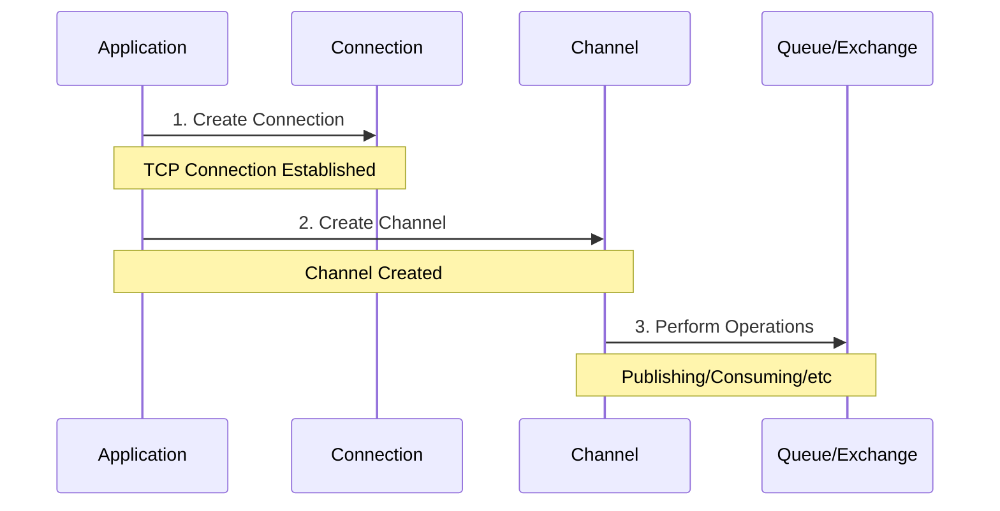
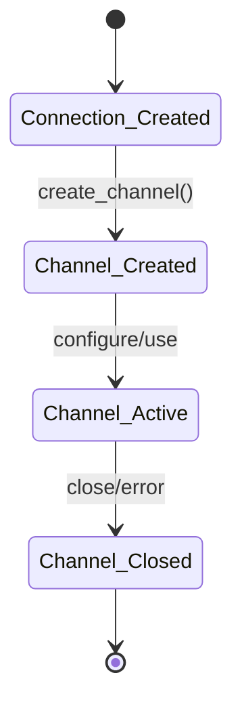
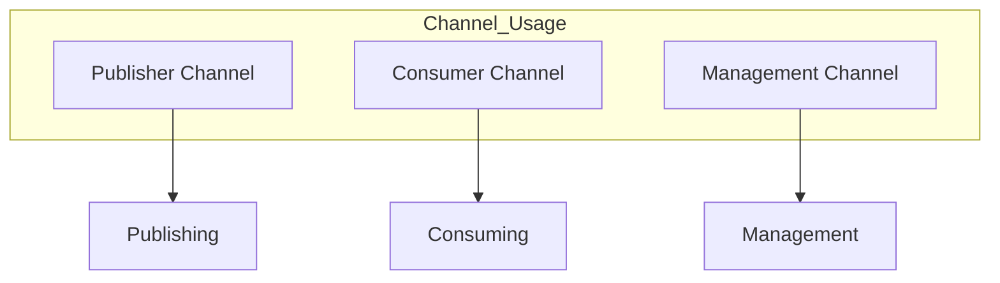
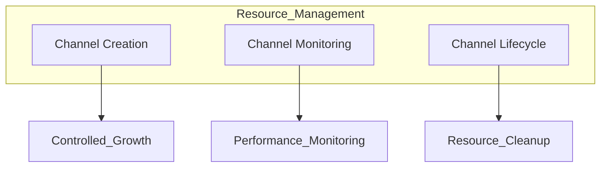
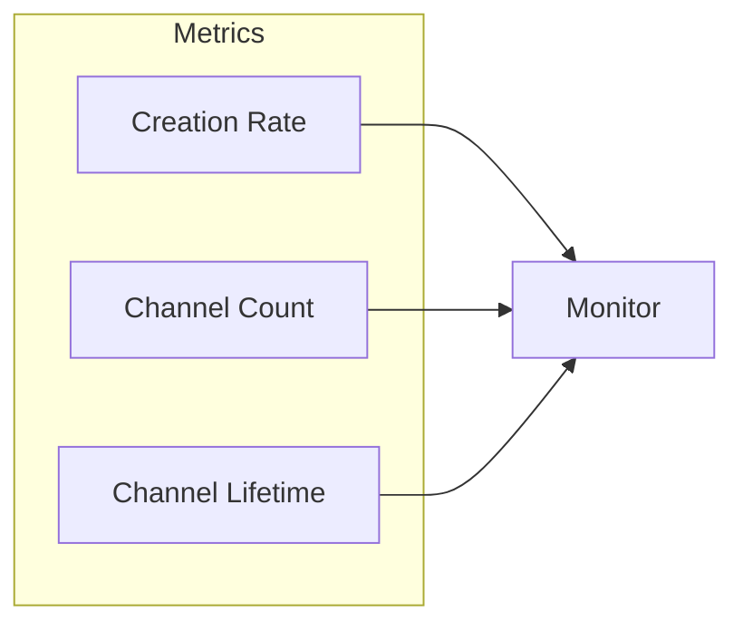

# RabbitMQ Channel Creation Guide

## When Are Channels Created?



### Common Channel Creation Scenarios

1. **Publisher Scenarios**
   - When starting to publish messages
   - For transaction management
   - For publisher confirms
   ```python
   # Python example
   channel = connection.channel()
   channel.confirm_delivery()  # Creates dedicated channel for confirms
   ```

2. **Consumer Scenarios**
   - When starting to consume messages
   - Setting up QoS prefetch
   - Handling acknowledgments
   ```python
   # Python example
   channel = connection.channel()
   channel.basic_qos(prefetch_count=10)
   channel.basic_consume(queue='my_queue', on_message_callback=callback)
   ```

3. **Management Operations**
   - Declaring queues/exchanges
   - Setting up bindings
   - Queue/Exchange deletion
   ```python
   # Python example
   channel = connection.channel()
   channel.queue_declare(queue='my_queue')
   channel.exchange_declare(exchange='my_exchange')
   ```

## Channel Lifecycle



### Channel States

1. **Creation**
   - After connection establishment
   - On-demand basis
   - Per operation type

2. **Active**
   - During message publishing
   - While consuming messages
   - During management tasks

3. **Closure**
   - Explicit closing
   - Error conditions
   - Connection termination

## Common Patterns

### 1. One Channel Per Thread
```python
# Python example
def worker_thread():
    channel = connection.channel()
    try:
        # Use channel for operations
        channel.basic_publish(...)
    finally:
        channel.close()
```

### 2. Channel Pool Pattern
```python
class ChannelPool:
    def __init__(self, connection, size=10):
        self.channels = []
        for _ in range(size):
            channel = connection.channel()
            self.channels.append(channel)
    
    def get_channel(self):
        return self.channels.pop()
    
    def return_channel(self, channel):
        self.channels.append(channel)
```

### 3. Dedicated Channels


## Best Practices

### 1. Channel Creation
- Create channels only when needed
- Reuse channels when possible
- Use channel pools for high-throughput scenarios

### 2. Error Handling
```python
# Python example
try:
    channel = connection.channel()
    # Use channel
except pika.exceptions.ChannelClosed:
    # Handle channel closure
finally:
    if channel and channel.is_open:
        channel.close()
```

### 3. Resource Management


## Common Issues

### 1. Channel Leaks
```python
# Bad Practice
def process_message():
    channel = connection.channel()  # Channel created but never closed
    channel.basic_publish(...)
    # Channel not closed

# Good Practice
def process_message():
    with connection.channel() as channel:  # Channel automatically closed
        channel.basic_publish(...)
```

### 2. Too Many Channels
```python
# Bad Practice
for message in messages:
    channel = connection.channel()  # New channel for each message
    channel.basic_publish(...)

# Good Practice
channel = connection.channel()  # Reuse single channel
for message in messages:
    channel.basic_publish(...)
```

## Monitoring Channel Creation

### 1. Channel Metrics
```bash
# Monitor channel creation
rabbitmqctl list_channels connection_details state

# Check channel count
rabbitmqctl list_connections channels
```

### 2. Channel Creation Rate


## Recommendations

1. **Creation Strategy**
   - Create channels strategically
   - Use channel pooling
   - Implement proper cleanup

2. **Monitoring**
   - Track channel creation rate
   - Monitor channel lifecycle
   - Set up alerts

3. **Management**
   - Regular cleanup
   - Error handling
   - Resource limits
