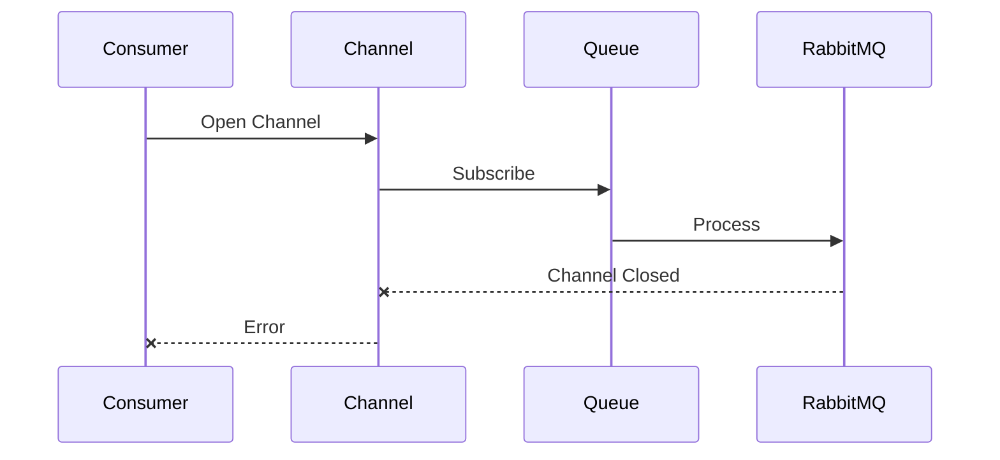
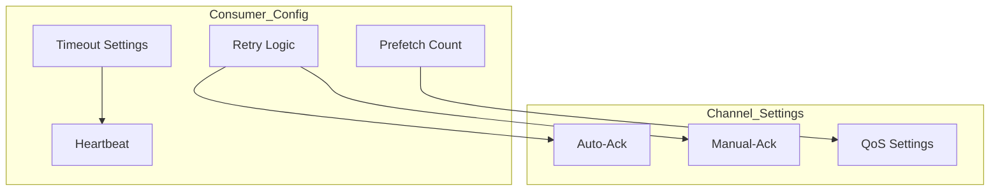
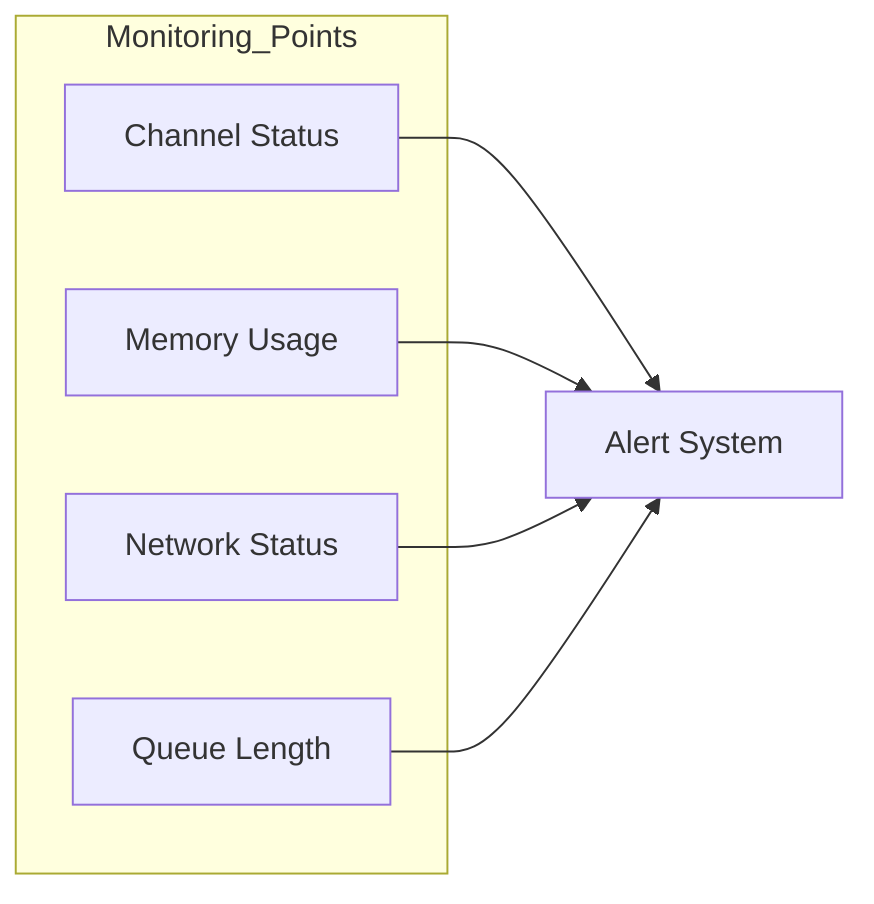
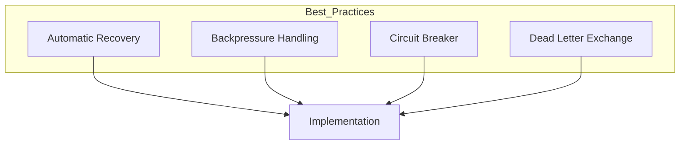

# RabbitMQ Channel Closed Error Debugging Guide

## Error Analysis
```
Error: failed at consumer 0 due to channel closed
```

This error typically occurs when:
1. Connection issues between consumer and RabbitMQ
2. Channel-level exceptions
3. Server-side closures
4. Client-side timeout
5. Resource constraints

## Debugging Steps

### 1. Check RabbitMQ Logs
```bash
# Check RabbitMQ server logs
tail -f /var/log/rabbitmq/rabbit@hostname.log | grep -i "channel"

# Check specific consumer connection
rabbitmqctl list_connections | grep <consumer_ip>

# Check channel details
rabbitmqctl list_channels
```

### 2. Monitor Channel Status



### 3. Common Causes and Solutions

#### A. Memory Pressure
```bash
# Check memory status
rabbitmqctl status | grep memory

# Monitor memory alarms
rabbitmqctl list_alarm
```

**Solution:**
```ini
# In rabbitmq.conf
vm_memory_high_watermark.relative = 0.7
vm_memory_high_watermark_paging_ratio = 0.75
```

#### B. Connection Issues
```bash
# List all connections
rabbitmqctl list_connections name peer_host state channels

# Check specific connection details
rabbitmqctl list_connections -q name peer_host state channels | grep <consumer_name>
```

#### C. Queue Issues
```bash
# Check queue status
rabbitmqctl list_queues name messages_ready messages_unacknowledged consumers

# Check queue details
rabbitmqctl list_queue_bindings <queue_name>
```

### 4. Consumer Configuration Check



#### Example Consumer Configuration
```python
# Python example with robust configuration
channel.basic_qos(prefetch_count=10)
channel.confirm_delivery()
connection.heartbeat = 580
```

```javascript
// Node.js example
channel.prefetch(10);
const options = {
    heartbeat: 580,
    connectionTimeout: 30000
};
```

### 5. Monitoring Setup



### 6. Preventive Measures

1. **Channel Management**
```javascript
// Implement channel pool
const channelPool = {
    maxSize: 10,
    timeout: 30000,
    retry: {
        max: 3,
        delay: 1000
    }
};
```

2. **Error Handling**
```python
def on_channel_closed(channel, reason):
    logger.error(f"Channel closed: {reason}")
    # Implement reconnection logic
    reconnect_with_backoff()
```

3. **Health Checks**
```bash
# Regular health check script
#!/bin/bash
check_rabbitmq() {
    rabbitmqctl status > /dev/null 2>&1
    if [ $? -eq 0 ]; then
        echo "RabbitMQ is running"
    else
        echo "RabbitMQ is down"
        notify_admin
    fi
}
```

### 7. Best Practices



1. **Connection Management**
   - Use connection pools
   - Implement automatic recovery
   - Set appropriate timeouts

2. **Channel Handling**
   - Limit channels per connection
   - Implement channel pooling
   - Handle channel closures gracefully

3. **Message Processing**
   - Implement proper acknowledgments
   - Use reasonable prefetch values
   - Handle errors appropriately

### 8. Diagnostic Commands

```bash
# Full diagnostic check
rabbitmq-diagnostics status
rabbitmq-diagnostics check_running
rabbitmq-diagnostics check_local_alarms

# Performance check
rabbitmq-diagnostics memory_breakdown
rabbitmq-diagnostics check_port_connectivity

# Cluster health
rabbitmq-diagnostics cluster_status
```

### 9. Recovery Steps

1. **Immediate Actions**
```bash
# Restart consumer processes
systemctl restart consumer-service

# Clear problematic queues if necessary
rabbitmqctl purge_queue queue_name
```

2. **Long-term Solutions**
   - Implement robust error handling
   - Set up monitoring and alerts
   - Regular maintenance checks
   - Documentation of incidents

### 10. Prevention Checklist

- [ ] Connection pools configured
- [ ] Channel limits set
- [ ] Proper error handling implemented
- [ ] Monitoring in place
- [ ] Alerts configured
- [ ] Regular health checks scheduled
- [ ] Backup consumers ready
- [ ] Documentation updated

## Quick Reference for Common Issues

| Issue | Check Command | Solution |
|-------|--------------|----------|
| Memory | `rabbitmqctl status \| grep memory` | Increase memory limit |
| Connections | `rabbitmqctl list_connections` | Implement connection pool |
| Channels | `rabbitmqctl list_channels` | Set channel limits |
| Queue Length | `rabbitmqctl list_queues` | Adjust consumer count |

## Contact Points

- System Administrator: `admin@example.com`
- RabbitMQ Support: `rabbitmq-support@example.com`
- Emergency Contact: `emergency@example.com`
