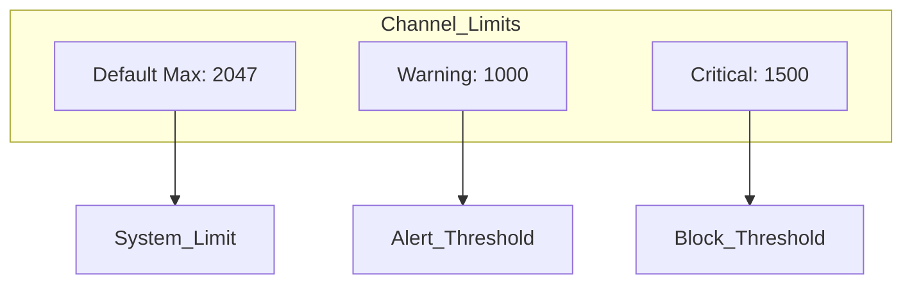
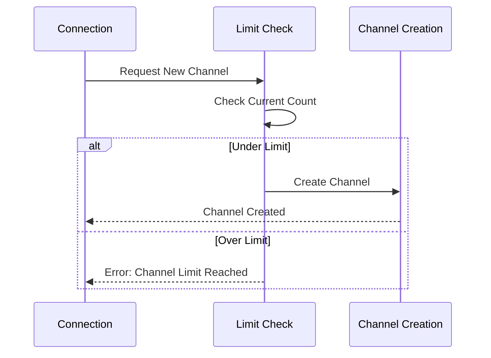
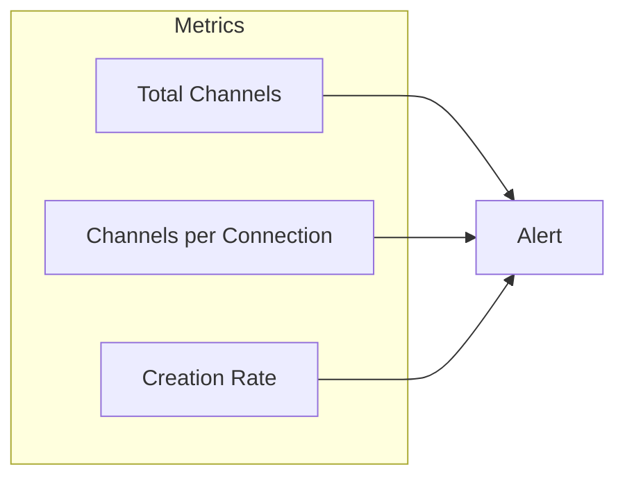
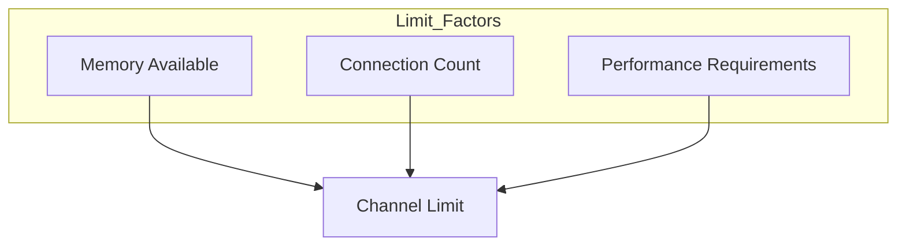
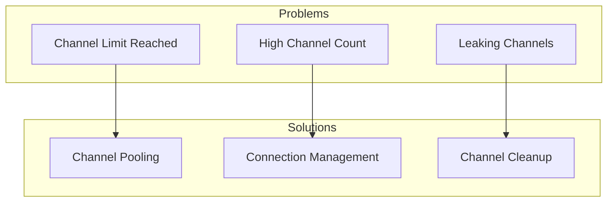
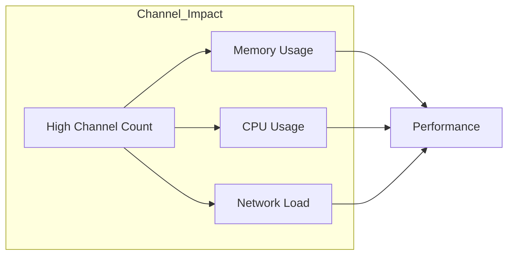

# RabbitMQ Channel Limits Guide

## Checking Channel Limits

### 1. Current Channel Status
```bash
# Check current channel count per connection
rabbitmqctl list_connections name channels

# Detailed connection info including channel limits
rabbitmqctl eval 'rabbit_connection_tracking:list().'

# Check specific connection limits
rabbitmqctl list_connections name channels max_channel_limit
```

### 2. Default Limits


## Configuring Channel Limits

### 1. Global Configuration
```ini
# In rabbitmq.conf
channel_max = 1000  # Set global channel limit per connection
```

### 2. Runtime Adjustment
```bash
# Set channel limit at runtime
rabbitmqctl eval 'application:set_env(rabbit, channel_max, 1000).'

# Verify the change
rabbitmqctl eval 'application:get_env(rabbit, channel_max).'
```

## Monitoring Channel Usage



### 1. Real-time Monitoring
```bash
# Monitor channel creation/closure
rabbitmqctl list_channels connection_details state

# Watch channel count in real-time
watch -n 1 'rabbitmqctl list_connections name channels'
```

### 2. Channel Metrics


## Alert Configuration

### 1. Channel Warning Thresholds
```ini
# Example Prometheus Alert Rules
- alert: HighChannelCount
  expr: rabbitmq_channels > 1000
  for: 5m
  labels:
    severity: warning
  annotations:
    description: "High channel count detected"

- alert: ChannelLimitNearing
  expr: rabbitmq_channels > 1500
  for: 5m
  labels:
    severity: critical
  annotations:
    description: "Channel limit threshold approaching"
```

### 2. Connection-Level Alerts
```bash
# Set up monitoring for connections nearing limit
rabbitmqctl set_policy channel-limit ".*" \
    '{"max-connections": 1000}' \
    --apply-to connections
```

## Best Practices

### 1. Setting Appropriate Limits


### 2. Channel Management Code
```python
# Python example with channel limits
class ChannelPool:
    def __init__(self, max_channels=100):
        self.max_channels = max_channels
        self.current_channels = 0
        
    def get_channel(self):
        if self.current_channels >= self.max_channels:
            raise Exception("Channel limit reached")
        self.current_channels += 1
        return create_new_channel()
```

```javascript
// Node.js example
const connection = await amqp.connect('amqp://localhost');
connection.on('error', (err) => {
    if (err.message.includes('channel limit')) {
        // Handle channel limit error
        console.error('Channel limit reached');
    }
});
```

## Troubleshooting

### 1. Common Issues


### 2. Diagnostic Commands
```bash
# Find connections with high channel count
rabbitmqctl list_connections name channels | sort -k2 -nr | head

# Check channel states
rabbitmqctl list_channels name connection state | grep -v running

# Monitor channel creation rate
rabbitmqctl list_channels reference connection_details | wc -l
```

## Recovery Steps

### 1. Immediate Actions
```bash
# Close idle channels
rabbitmqctl eval 'rabbit_channel:close_all_channels().'

# Close specific connection
rabbitmqctl close_connection "<connection_name>" "Too many channels"
```

### 2. Long-term Solutions
- Implement channel pooling
- Set up monitoring and alerts
- Regular maintenance checks
- Documentation of incidents

## Performance Impact



### Resource Guidelines
1. **Memory per Channel**
   - Idle: ~1KB
   - Active: ~2-3KB
   - With large messages: Variable

2. **Network Impact**
   - Heartbeat overhead
   - Message throughput
   - TCP connection load

## Recommendations

1. **Initial Setup**
   - Start with conservative limits
   - Monitor usage patterns
   - Adjust based on performance

2. **Ongoing Management**
   - Regular monitoring
   - Proactive alerts
   - Periodic review

3. **Emergency Response**
   - Clear escalation path
   - Documented procedures
   - Recovery scripts ready
