# Understanding RabbitMQ Channels

## What are Channels?

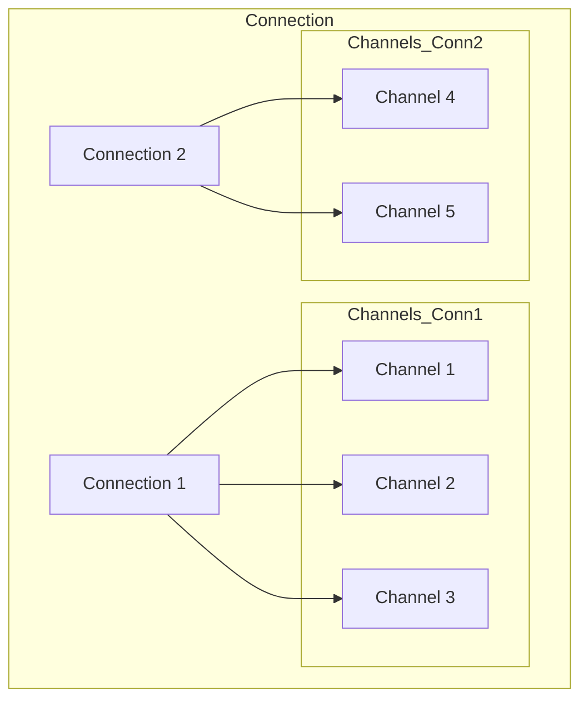

Channels are lightweight connections that share a single TCP connection. They're used to:
- Publish messages
- Consume messages
- Declare queues/exchanges
- Manage bindings

## Channel Monitoring

### 1. Total Channels Metric
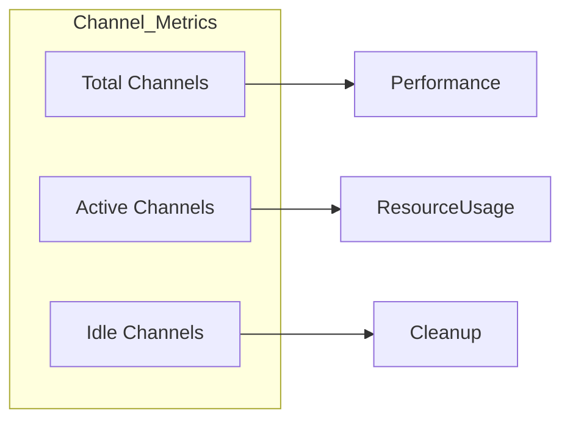

To check total channels:
```bash
# List all channels
rabbitmqctl list_channels

# Get channel count
rabbitmqctl list_channels | wc -l

# Detailed channel info
rabbitmqctl list_channels name connection_details state
```

### 2. Channel States

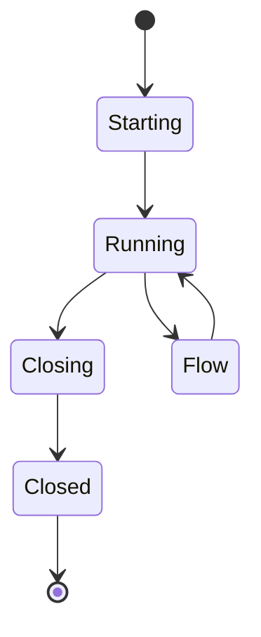

## Channel Usage Patterns

### 1. Publisher Channels
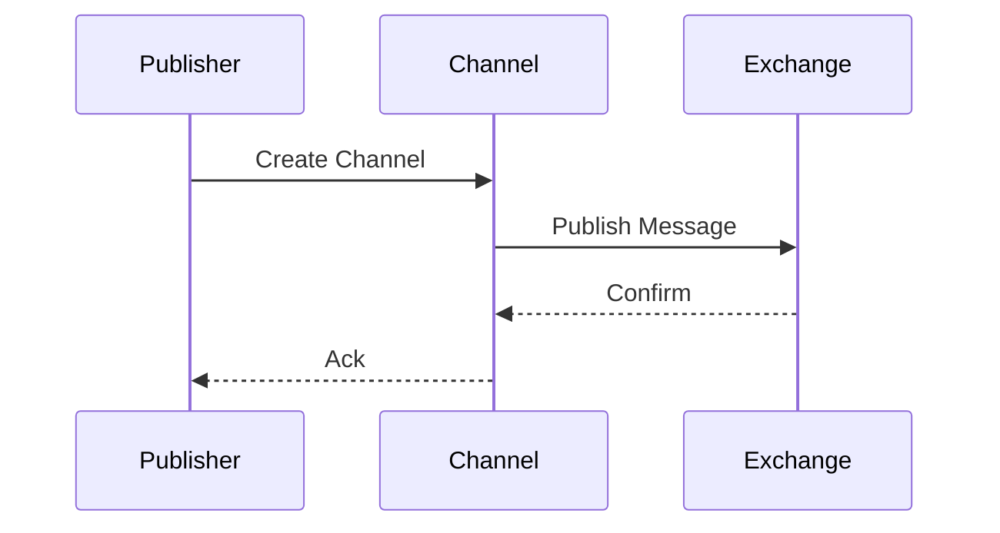

### 2. Consumer Channels
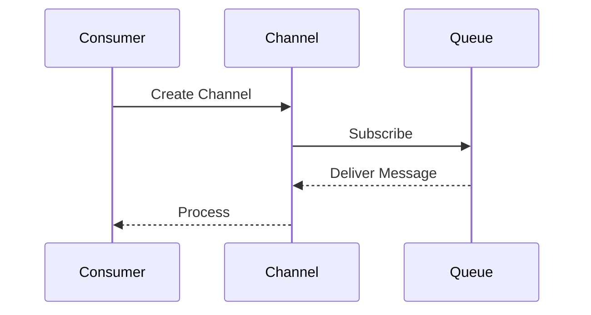

## Channel Limits and Thresholds

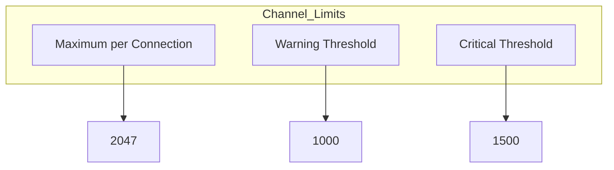

### Default Limits
- Maximum channels per connection: 2047
- Recommended max per connection: 100-200
- Warning threshold: ~1000 total channels

## Monitoring Dashboard Metrics

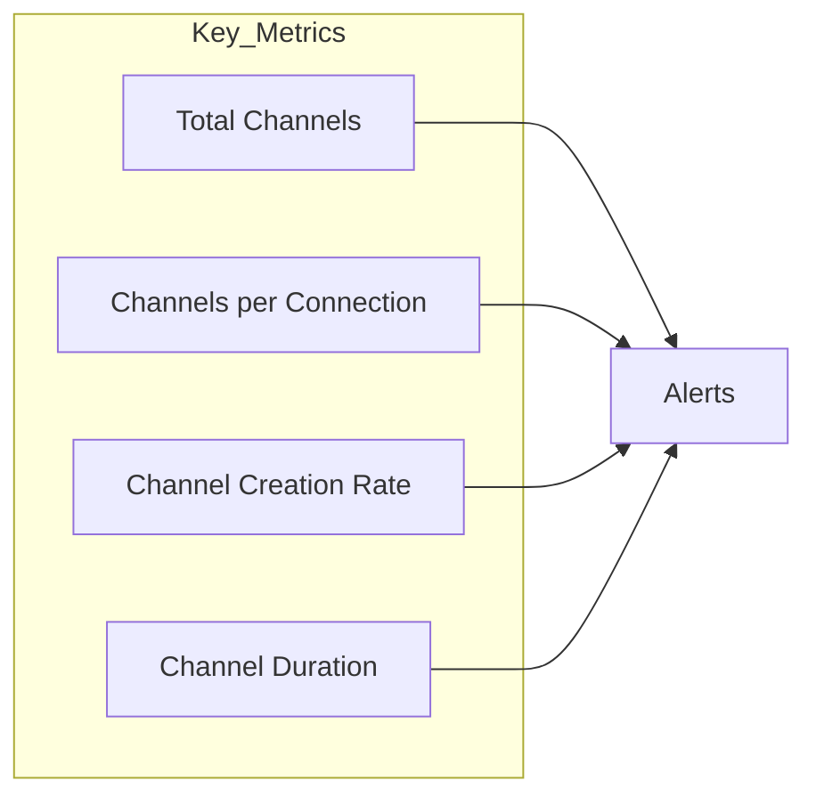

### Important Metrics to Watch
1. **Total Channels**
   - Current active channels
   - Historical trend
   - Peak usage

2. **Channels per Connection**
   - Distribution
   - Outliers
   - Potential bottlenecks

3. **Channel Lifecycle**
   - Creation rate
   - Closure rate
   - Average lifespan

## Best Practices

### 1. Channel Management
```python
# Python example of channel pooling
class ChannelPool:
    def __init__(self, max_size=10):
        self.max_size = max_size
        self.channels = []
    
    def get_channel(self):
        if len(self.channels) < self.max_size:
            return create_new_channel()
        return wait_for_available_channel()
```

### 2. Channel Optimization
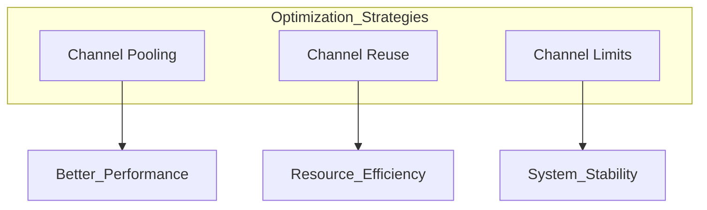

## Troubleshooting High Channel Count

### 1. Diagnostic Commands
```bash
# Check channel distribution
rabbitmqctl list_connections client_properties channels

# Identify busy channels
rabbitmqctl list_channels name connection messages_unacknowledged

# Monitor channel creation
rabbitmqctl list_channels connection messages_unconfirmed
```

### 2. Common Issues and Solutions

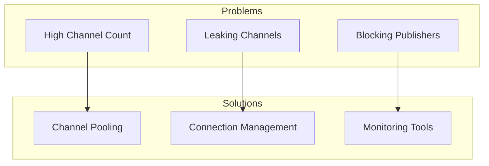

## Channel Health Indicators

### 1. Good Health
- Stable channel count
- Even distribution across connections
- Regular channel turnover
- Low unacked messages

### 2. Warning Signs
- Rapidly increasing channel count
- Many channels per connection
- Long-lived unused channels
- High unacked message count

## Monitoring Setup

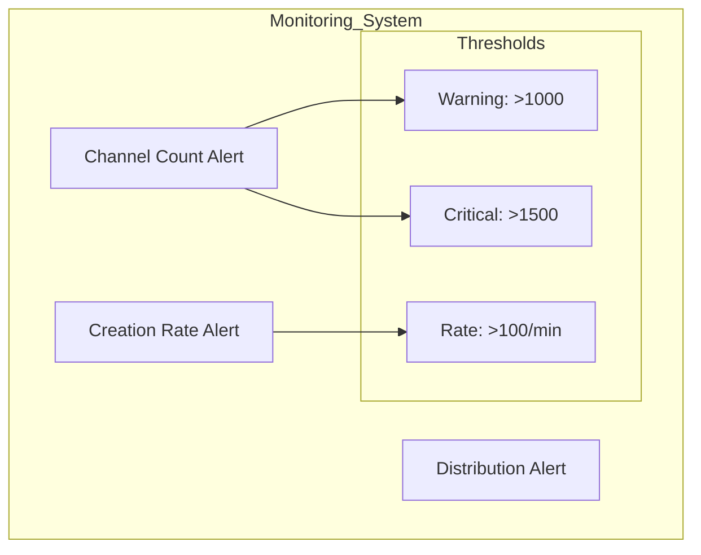

### Alert Configuration
```ini
# Example Prometheus Alert
- alert: HighChannelCount
  expr: rabbitmq_channels > 1000
  for: 5m
  labels:
    severity: warning
  annotations:
    description: "High channel count detected"
```

## Performance Impact

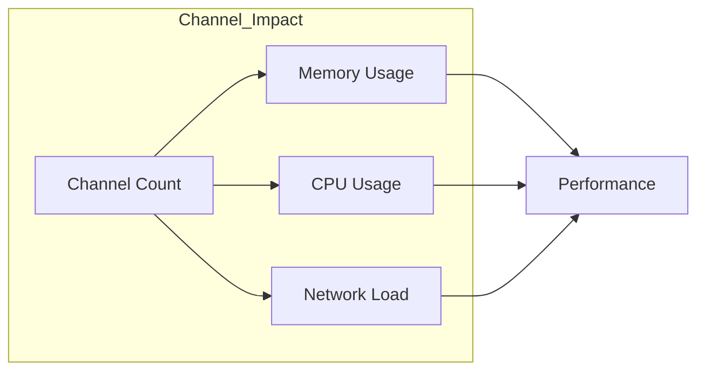

### Resource Usage Guidelines
1. **Memory**
   - ~1KB per idle channel
   - ~2-3KB per active channel
   - Additional memory for buffers

2. **Network**
   - TCP connection overhead
   - Message throughput impact
   - Heartbeat considerations

## Channel Management Strategies

### 1. For Publishers
```javascript
// Node.js example of channel management
const channel = await connection.createChannel();
channel.on('return', handleReturn);
channel.on('drain', handleDrain);
```

### 2. For Consumers
```python
# Python example of consumer channel
channel.basic_qos(prefetch_count=10)
channel.basic_consume(queue='my_queue', 
                     on_message_callback=callback)
```

## Recommendations

1. **Channel Creation**
   - Use channel pools
   - Implement proper error handling
   - Set appropriate QoS

2. **Monitoring**
   - Track channel metrics
   - Set up alerts
   - Regular health checks

3. **Optimization**
   - Reuse channels when possible
   - Clean up unused channels
   - Monitor resource usage
