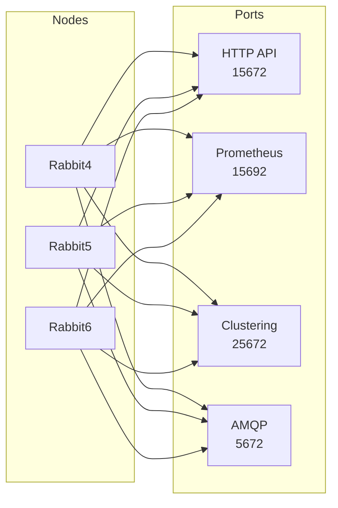
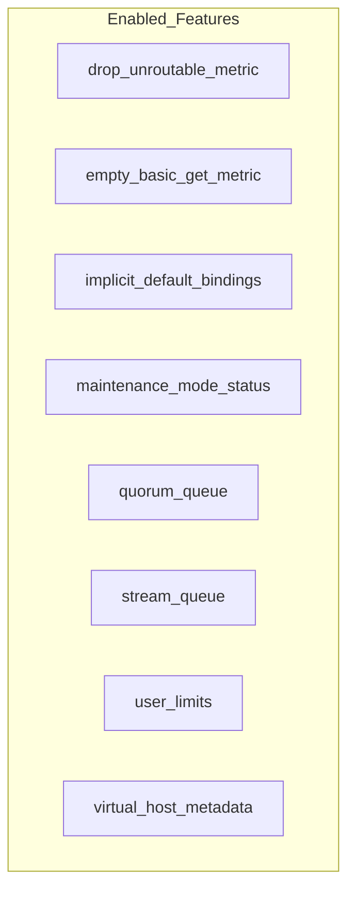
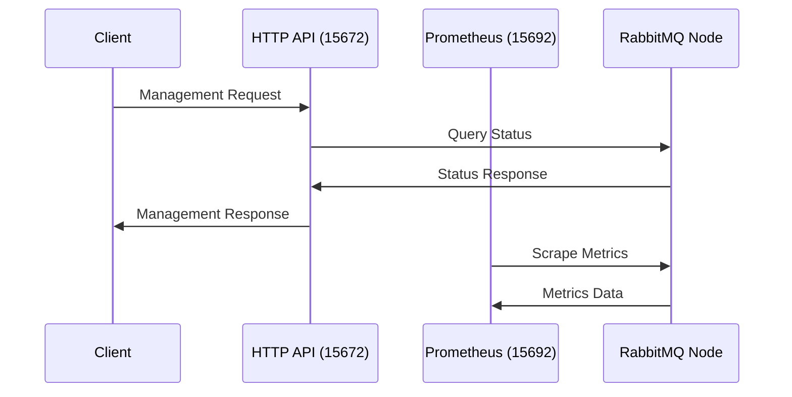

# RabbitMQ Cluster Analysis

## Cluster Overview

```mermaid
graph TB
    subgraph RabbitMQ_Cluster[Cluster: rabbit@dc-tcbs-redis01]
        subgraph Disk_Nodes[Disk Nodes]
            R4[rabbit@dc-tcbs-Rabbit4]
            R5[rabbit@dc-tcbs-Rabbit5]
            R6[rabbit@dc-tcbs-Rabbit6]
        end
        
        subgraph Versions[All Nodes: RabbitMQ 3.9.11 on Erlang 24.1.7]
            R4 --- R5
            R5 --- R6
            R6 --- R4
        end
    end
```

## Node Details

### Running Nodes
- `rabbit@dc-tcbs-Rabbit4` (Primary)
- `rabbit@dc-tcbs-Rabbit5`
- `rabbit@dc-tcbs-Rabbit6`

### Maintenance Status
All nodes are operational and not under maintenance.

### Health Status
- No Alarms
- No Network Partitions

## Port Configuration



### Port Details
1. **HTTP API (15672)**
   - Management interface
   - Monitoring and administration

2. **Prometheus (15692)**
   - Metrics export
   - Monitoring integration

3. **Clustering (25672)**
   - Inter-node communication
   - CLI tool communication

4. **AMQP (5672)**
   - Main message protocol
   - AMQP 0-9-1 and 1.0 support

## Feature Flags Status



### Enabled Features
1. **Message Routing**
   - `drop_unroutable_metric`: Tracks unroutable messages
   - `empty_basic_get_metric`: Monitors empty message gets

2. **Queue Management**
   - `quorum_queue`: Distributed queue type
   - `stream_queue`: Streaming queue support

3. **System Features**
   - `maintenance_mode_status`: Maintenance mode support
   - `user_limits`: Resource limits per user
   - `virtual_host_metadata`: vhost metadata support
   - `implicit_default_bindings`: Default binding behavior

## High Availability Setup

```mermaid
flowchart TB
    subgraph HA_Configuration
        direction TB
        
        subgraph Data_Replication
            Q[Queue] --> R4C[Rabbit4 Copy]
            Q --> R5C[Rabbit5 Copy]
            Q --> R6C[Rabbit6 Copy]
        end
        
        subgraph Failover
            R4C --> Failover
            R5C --> Failover
            R6C --> Failover
        end
    end
```

### Cluster Characteristics
1. **Disk Nodes**
   - All nodes are disk nodes
   - Full data persistence
   - High durability

2. **Version Consistency**
   - Uniform version across nodes
   - RabbitMQ: 3.9.11
   - Erlang: 24.1.7

3. **Network Configuration**
   - No partitions
   - Full mesh connectivity
   - Interface: [::]

## Monitoring and Management



### Key Monitoring Points
1. **Management Interface**
   - Web UI access
   - REST API endpoints
   - Configuration management

2. **Prometheus Integration**
   - Metric collection
   - Performance monitoring
   - Alert configuration

3. **Cluster Health**
   - Node status monitoring
   - Queue metrics
   - Connection tracking

## Best Practices and Recommendations

1. **Load Balancing**
   - Distribute connections across nodes
   - Monitor queue distribution
   - Balance resource usage

2. **Maintenance**
   - Regular monitoring of alarms
   - Version upgrade planning
   - Feature flag management

3. **Security**
   - Port access control
   - Authentication setup
   - SSL/TLS configuration

4. **Backup and Recovery**
   - Regular configuration backups
   - Node failure procedures
   - Data recovery plans
