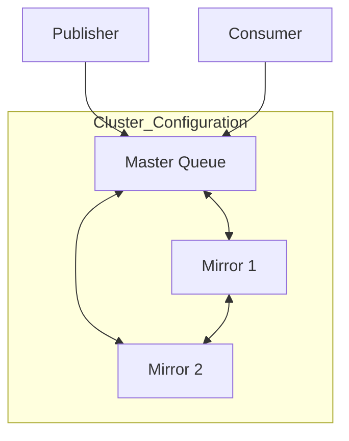
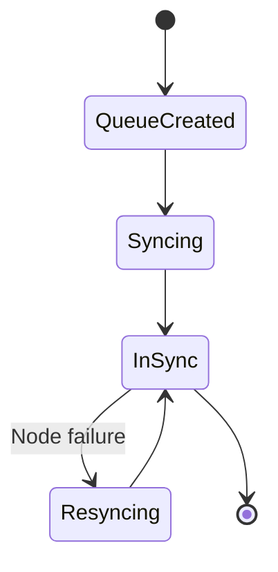
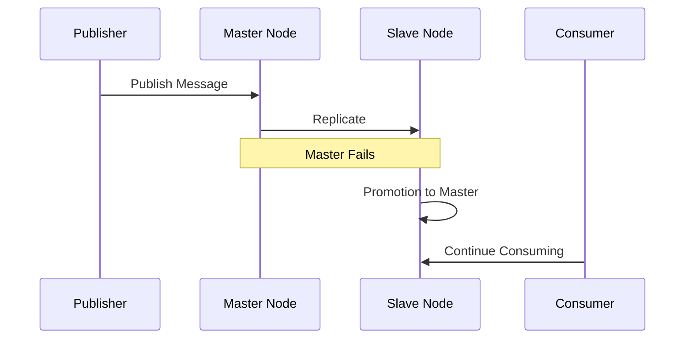
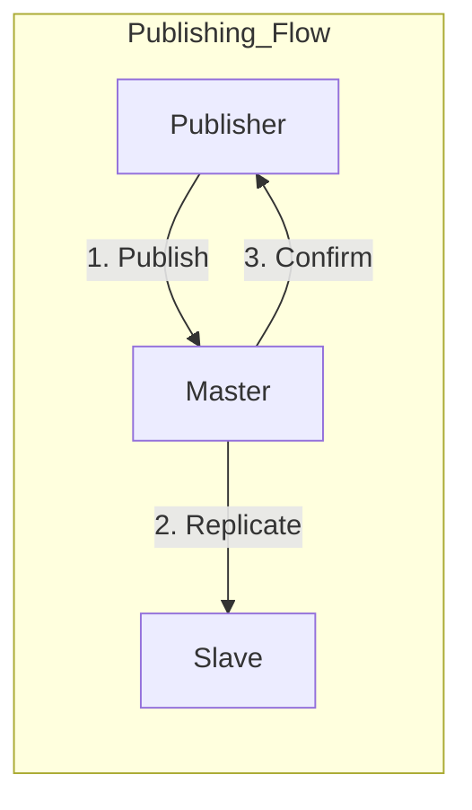
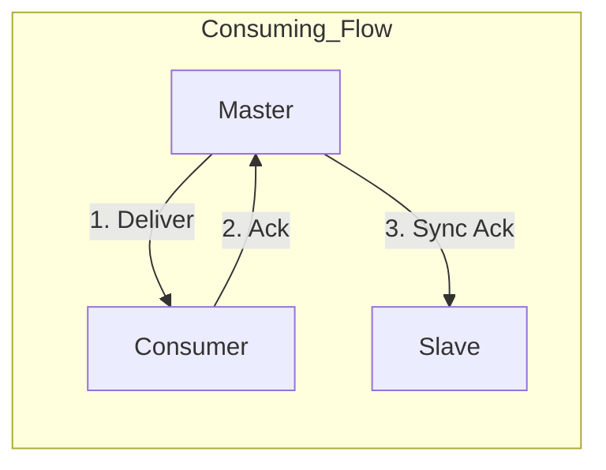

# RabbitMQ Cluster Settings Explained

## Understanding `cluster: 1`



### What `cluster: 1` Means

1. **Queue Replication Factor**
   - `1`: Minimum number of nodes that must acknowledge a message
   - Affects data durability and availability
   - Part of RabbitMQ's "Quorum Queues" feature

2. **High Availability Policy**
   ```bash
   # Example HA policy setting
   rabbitmqctl set_policy ha-policy "^ixu\.i\.q\." \
       '{"ha-mode":"exactly","ha-params":1,"ha-sync-mode":"automatic"}'
   ```

## Queue Synchronization States



### Synchronization Process
1. **Initial Setup**
   - Queue created on primary node
   - Replication configured based on policy
   - Synchronization begins

2. **Normal Operation**
   - Messages replicated to mirror(s)
   - Acknowledgments synchronized
   - Automatic failover if needed

## Failover Scenarios



### Failover Process
1. **Node Failure Detection**
   - Heartbeat timeout
   - Network partition
   - Planned shutdown

2. **Promotion Process**
   - Mirror promotion to master
   - Client reconnection
   - Queue operation resumption

## Impact on Operations

### 1. Publishing


- Messages sent to master node
- Waits for replication acknowledgment
- Publisher confirms after replication

### 2. Consuming


- Consumers connect to master
- Acknowledgments synchronized
- Automatic reconnection on failover

## Configuration Best Practices

### 1. Queue Settings
```yaml
queues:
  example-queue:
    name: "ixu.i.q.example"
    cluster: 1  # Minimum acknowledgment requirement
    durable: true
    auto-delete: false
```

### 2. Policy Configuration
```bash
# Set queue policy
rabbitmqctl set_policy ha-queues \
    "^ixu\.i\.q\." \
    '{"ha-mode":"exactly","ha-params":1,"ha-sync-mode":"automatic"}' \
    --priority 1 \
    --apply-to queues
```

## Monitoring Cluster Health

### 1. Cluster Status
```bash
# Check cluster status
rabbitmqctl cluster_status

# Check queue synchronization
rabbitmqctl list_queues name slave_pids synchronised_slave_pids
```

### 2. Queue Metrics
```bash
# Monitor queue status
rabbitmqctl list_queues name messages_ready messages_unacknowledged slave_nodes synchronised_slave_nodes
```

## Performance Implications

### 1. Write Operations
- Messages must be replicated
- Increased latency for confirmations
- Network bandwidth usage

### 2. Read Operations
- Reads from master node only
- No load balancing for consumers
- Failover may cause brief interruption

## Recommended Settings

### 1. Small Clusters (1-3 nodes)
```yaml
cluster: 1  # Suitable for basic HA
```

### 2. Medium Clusters (3-5 nodes)
```yaml
cluster: 2  # Better durability
```

### 3. Large Clusters (5+ nodes)
```yaml
cluster: 3  # Maximum durability
```

## Troubleshooting

### 1. Common Issues
- Split-brain scenarios
- Synchronization delays
- Network partitions

### 2. Resolution Steps
```bash
# Check node health
rabbitmqctl node_health_check

# Force queue synchronization
rabbitmqctl sync_queue "queue_name"

# Check cluster partition status
rabbitmqctl cluster_status
```

## Maintenance Considerations

### 1. Node Management
- Rolling upgrades
- Planned failovers
- Maintenance windows

### 2. Monitoring Setup
```bash
# Essential monitoring commands
rabbitmqctl list_queues name policy slave_nodes synchronised_slave_nodes

# Check policy effectiveness
rabbitmqctl list_policies

# Monitor queue operations
rabbitmqctl list_queues name messages_ready messages_unacknowledged message_bytes_persistent
```
