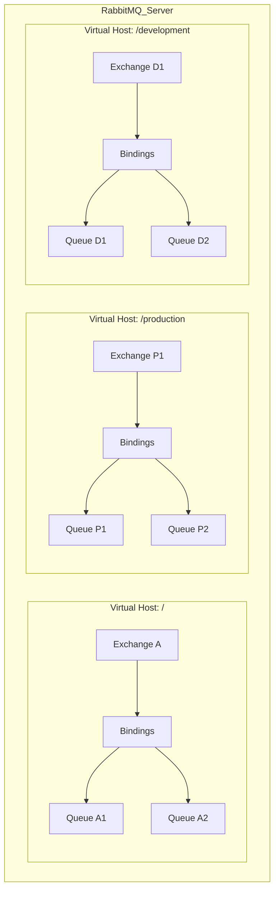
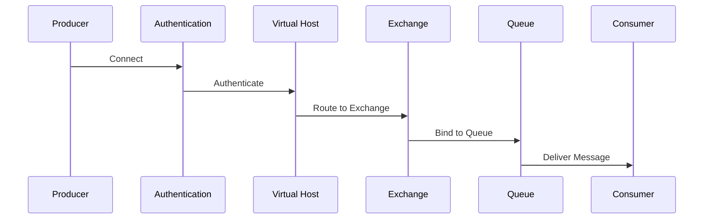
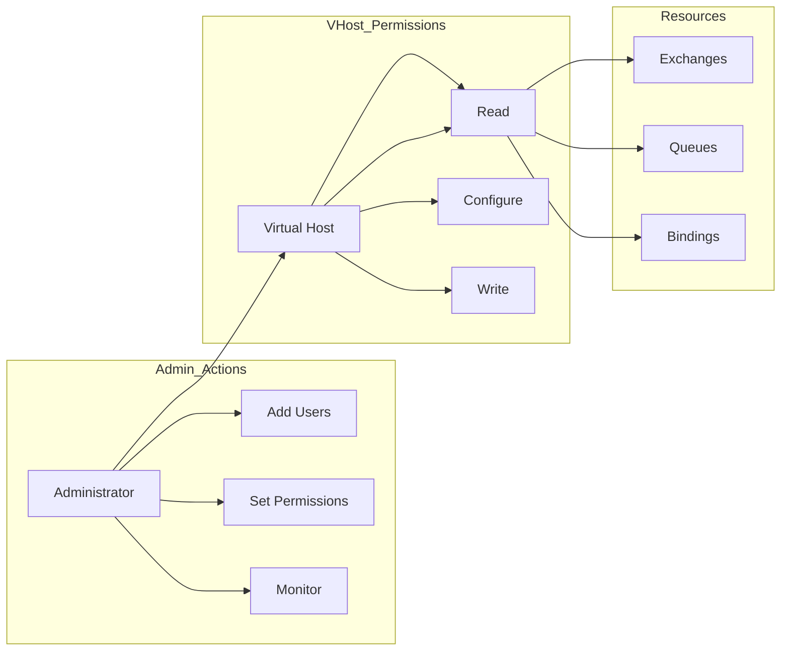
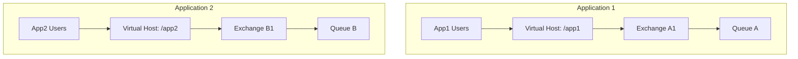
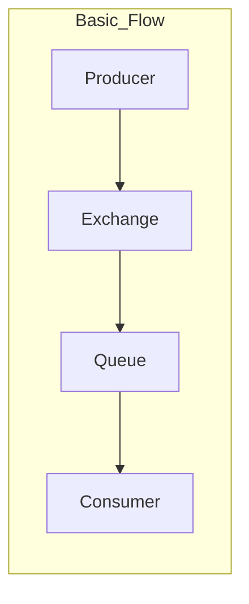
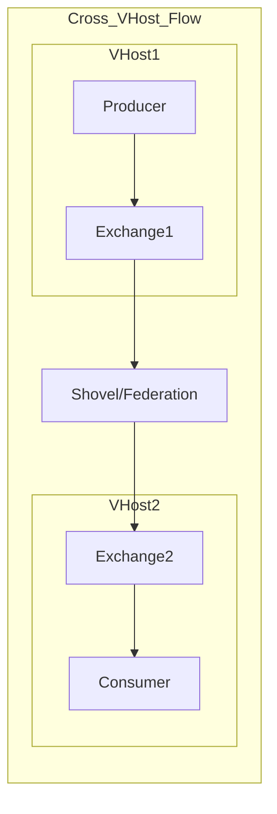
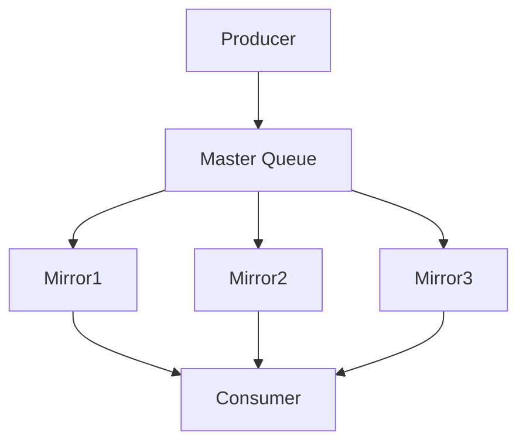
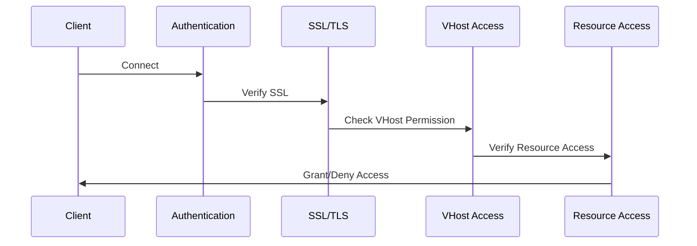

# RabbitMQ Deployment Guide

## Table of Contents
- [Local Development Setup](#local-development-setup)
- [Docker Deployment](#docker-deployment)
- [Kubernetes Deployment](#kubernetes-deployment)
- [Cloud Deployments](#cloud-deployments)
- [Clustering Setup](#clustering-setup)
- [Security Configuration](#security-configuration)
- [Monitoring Setup](#monitoring-setup)
- [Erlang in RabbitMQ](#erlang-in-rabbitmq)
- [High Availability (HA) Setup](#high-availability-ha-setup)
- [RabbitMQ Management UI](#rabbitmq-management-ui)
- [Virtual Hosts in RabbitMQ](#virtual-hosts-in-rabbitmq)

## Local Development Setup

### Prerequisites
- Erlang/OTP 24.0 or later
- Python 3.8+ (for management tools)
- Administrative privileges

### Installation Steps

#### Ubuntu/Debian
```bash
# Add RabbitMQ signing key
curl -fsSL https://github.com/rabbitmq/signing-keys/releases/download/2.0/rabbitmq-release-signing-key.asc | sudo apt-key add -

# Add RabbitMQ repository
sudo apt-get install apt-transport-https
echo "deb https://dl.bintray.com/rabbitmq/debian focal main" | sudo tee /etc/apt/sources.list.d/rabbitmq.list

# Install RabbitMQ
sudo apt-get update
sudo apt-get install rabbitmq-server

# Start the service
sudo systemctl start rabbitmq-server
sudo systemctl enable rabbitmq-server

# Enable management plugin
sudo rabbitmq-plugins enable rabbitmq_management
```

#### MacOS
```bash
# Using Homebrew
brew update
brew install rabbitmq

# Start the service
brew services start rabbitmq
```

### Detailed Ubuntu Setup with Systemctl

#### System Requirements
```bash
# Check system requirements
free -m                    # Check available memory (recommended: 2GB+)
df -h                      # Check disk space (recommended: 10GB+)
nproc                      # Check CPU cores (recommended: 2+)
ulimit -n                  # Check file descriptor limits (recommended: 65536)
```

#### Installation Process
```bash
# Update package list
sudo apt-get update

# Install required dependencies
sudo apt-get install -y curl gnupg apt-transport-https

# Add RabbitMQ signing key
curl -fsSL https://github.com/rabbitmq/signing-keys/releases/download/2.0/rabbitmq-release-signing-key.asc | sudo apt-key add -

# Add Erlang repository
curl -s https://packagecloud.io/install/repositories/rabbitmq/erlang/script.deb.sh | sudo bash

# Add RabbitMQ repository
curl -s https://packagecloud.io/install/repositories/rabbitmq/rabbitmq-server/script.deb.sh | sudo bash

# Install RabbitMQ server
sudo apt-get install -y rabbitmq-server
```

#### Systemctl Management

1. **Basic Service Management**
```bash
# Start RabbitMQ service
sudo systemctl start rabbitmq-server

# Stop RabbitMQ service
sudo systemctl stop rabbitmq-server

# Restart RabbitMQ service
sudo systemctl restart rabbitmq-server

# Check service status
sudo systemctl status rabbitmq-server

# Enable RabbitMQ to start on boot
sudo systemctl enable rabbitmq-server

# Disable RabbitMQ from starting on boot
sudo systemctl disable rabbitmq-server
```

2. **Service Configuration**
```bash
# Edit systemd service file
sudo systemctl edit rabbitmq-server

# Example configuration
[Service]
LimitNOFILE=65536
Environment=RABBITMQ_LOGS=/var/log/rabbitmq/rabbitmq.log
Environment=RABBITMQ_SASL_LOGS=/var/log/rabbitmq/rabbitmq-sasl.log
```

3. **Systemd Service File Location**
```bash
# View default service file
cat /lib/systemd/system/rabbitmq-server.service

# Create custom service file
sudo nano /etc/systemd/system/rabbitmq-server.service.d/override.conf
```

#### RabbitMQ Server Startup Options

1. **Configuration File Options**
```ini
# /etc/rabbitmq/rabbitmq.conf

# Node name
node.name = rabbit@localhost

# Networking
listeners.tcp.default = 5672
management.tcp.port = 15672

# Memory
vm_memory_high_watermark.relative = 0.7
vm_memory_high_watermark.paging_ratio = 0.75

# Disk
disk_free_limit.absolute = 2GB

# Security
default_user = admin
default_pass = secure_password
default_vhost = /
```

2. **Environment Variables**
```bash
# /etc/rabbitmq/rabbitmq-env.conf

# Node configuration
RABBITMQ_NODENAME=rabbit@myhost
RABBITMQ_NODE_PORT=5672
RABBITMQ_DIST_PORT=25672

# Memory and IO settings
RABBITMQ_SERVER_START_ARGS="+P 1048576 +t 5000000 +stbt db"
RABBITMQ_MAX_NUMBER_OF_PROCESSES=1048576
RABBITMQ_LOGS=/var/log/rabbitmq/rabbit.log
RABBITMQ_SASL_LOGS=/var/log/rabbitmq/rabbit-sasl.log

# SSL/TLS configuration
RABBITMQ_SSL_CACERTFILE=/path/to/ca_certificate.pem
RABBITMQ_SSL_CERTFILE=/path/to/server_certificate.pem
RABBITMQ_SSL_KEYFILE=/path/to/server_key.pem
```

3. **Command Line Arguments**
```bash
# Start with specific configuration file
rabbitmq-server -config /path/to/custom/rabbitmq.conf

# Start with debug logging
rabbitmq-server -detached -rabbit log_levels [{connection,debug}]

# Start with custom Erlang cookie
RABBITMQ_ERLANG_COOKIE='your_secret_cookie' rabbitmq-server

# Start with specific node name
RABBITMQ_NODENAME=rabbit@custom_host rabbitmq-server
```

4. **Performance Tuning Options**
```bash
# Edit /etc/default/rabbitmq-server

# Increase file descriptors
ulimit -n 65536

# Erlang scheduler threads
export RABBITMQ_SERVER_ADDITIONAL_ERL_ARGS="+S 2:2"

# Garbage collection settings
export RABBITMQ_SERVER_ADDITIONAL_ERL_ARGS="+P 1048576 +t 5000000 +stbt db +zdbbl 32768"
```

#### Monitoring and Maintenance

1. **Log Management**
```bash
# View logs
tail -f /var/log/rabbitmq/rabbit@hostname.log
tail -f /var/log/rabbitmq/rabbit@hostname-sasl.log

# Rotate logs
rabbitmqctl rotate_logs
```

2. **Status Checks**
```bash
# Check cluster status
sudo rabbitmqctl cluster_status

# Check node health
sudo rabbitmqctl node_health_check

# List queues
sudo rabbitmqctl list_queues name messages_ready messages_unacknowledged

# List exchanges
sudo rabbitmqctl list_exchanges name type
```

3. **Resource Monitoring**
```bash
# Monitor memory usage
rabbitmqctl status | grep memory

# Check file descriptor usage
rabbitmqctl status | grep file_descriptors

# List connections
rabbitmqctl list_connections user peer_host state
```

4. **Backup and Restore**
```bash
# Export definitions
rabbitmqctl export_definitions /path/to/backup.json

# Import definitions
rabbitmqctl import_definitions /path/to/backup.json
```

## Docker Deployment

### Single Node Deployment
```yaml
# docker-compose.yml
version: '3.8'
services:
  rabbitmq:
    image: rabbitmq:3.12-management
    container_name: rabbitmq
    ports:
      - "5672:5672"   # AMQP protocol
      - "15672:15672" # Management UI
    environment:
      - RABBITMQ_DEFAULT_USER=admin
      - RABBITMQ_DEFAULT_PASS=admin123
    volumes:
      - rabbitmq_data:/var/lib/rabbitmq
      - rabbitmq_log:/var/log/rabbitmq

volumes:
  rabbitmq_data:
  rabbitmq_log:
```

### Cluster Deployment
```yaml
# docker-compose-cluster.yml
version: '3.8'
services:
  rabbitmq1:
    image: rabbitmq:3.12-management
    hostname: rabbitmq1
    environment:
      - RABBITMQ_ERLANG_COOKIE=SWQOKODSQALRPCLNMEQG
      - RABBITMQ_DEFAULT_USER=admin
      - RABBITMQ_DEFAULT_PASS=admin123
    ports:
      - "5672:5672"
      - "15672:15672"

  rabbitmq2:
    image: rabbitmq:3.12-management
    hostname: rabbitmq2
    environment:
      - RABBITMQ_ERLANG_COOKIE=SWQOKODSQALRPCLNMEQG
      - RABBITMQ_DEFAULT_USER=admin
      - RABBITMQ_DEFAULT_PASS=admin123
    ports:
      - "5673:5672"
      - "15673:15672"

  rabbitmq3:
    image: rabbitmq:3.12-management
    hostname: rabbitmq3
    environment:
      - RABBITMQ_ERLANG_COOKIE=SWQOKODSQALRPCLNMEQG
      - RABBITMQ_DEFAULT_USER=admin
      - RABBITMQ_DEFAULT_PASS=admin123
    ports:
      - "5674:5672"
      - "15674:15672"
```

## Kubernetes Deployment

### Using Helm Chart
```bash
# Add RabbitMQ Helm repository
helm repo add bitnami https://charts.bitnami.com/bitnami
helm repo update

# Create namespace
kubectl create namespace rabbitmq

# Install RabbitMQ
helm install rabbitmq bitnami/rabbitmq \
  --namespace rabbitmq \
  --set auth.username=admin \
  --set auth.password=admin123 \
  --set replicaCount=3
```

### Manual Deployment
```yaml
# rabbitmq-configmap.yaml
apiVersion: v1
kind: ConfigMap
metadata:
  name: rabbitmq-config
data:
  enabled_plugins: |
    [rabbitmq_management,rabbitmq_peer_discovery_k8s].
  rabbitmq.conf: |
    cluster_formation.peer_discovery_backend = rabbit_peer_discovery_classic_config
    cluster_formation.classic_config.nodes.1 = rabbit@rabbitmq-0.rabbitmq.default.svc.cluster.local
    cluster_formation.classic_config.nodes.2 = rabbit@rabbitmq-1.rabbitmq.default.svc.cluster.local
    cluster_formation.classic_config.nodes.3 = rabbit@rabbitmq-2.rabbitmq.default.svc.cluster.local

---
# rabbitmq-statefulset.yaml
apiVersion: apps/v1
kind: StatefulSet
metadata:
  name: rabbitmq
spec:
  serviceName: rabbitmq
  replicas: 3
  selector:
    matchLabels:
      app: rabbitmq
  template:
    metadata:
      labels:
        app: rabbitmq
    spec:
      containers:
      - name: rabbitmq
        image: rabbitmq:3.12-management
        ports:
        - containerPort: 5672
          name: amqp
        - containerPort: 15672
          name: http
        env:
        - name: RABBITMQ_DEFAULT_USER
          valueFrom:
            secretKeyRef:
              name: rabbitmq-secret
              key: username
        - name: RABBITMQ_DEFAULT_PASS
          valueFrom:
            secretKeyRef:
              name: rabbitmq-secret
              key: password
```

## Cloud Deployments

### AWS CloudFormation
```yaml
AWSTemplateFormatVersion: '2010-09-09'
Resources:
  RabbitMQInstance:
    Type: AWS::EC2::Instance
    Properties:
      ImageId: ami-0123456789abcdef0  # Amazon Linux 2 AMI
      InstanceType: t3.medium
      SecurityGroups:
        - !Ref RabbitMQSecurityGroup
      UserData:
        Fn::Base64: !Sub |
          #!/bin/bash
          yum update -y
          yum install -y erlang
          # RabbitMQ installation commands...

  RabbitMQSecurityGroup:
    Type: AWS::EC2::SecurityGroup
    Properties:
      GroupDescription: RabbitMQ Security Group
      SecurityGroupIngress:
        - IpProtocol: tcp
          FromPort: 5672
          ToPort: 5672
          CidrIp: 0.0.0.0/0
        - IpProtocol: tcp
          FromPort: 15672
          ToPort: 15672
          CidrIp: 0.0.0.0/0
```

### Azure Resource Manager
```json
{
    "$schema": "https://schema.management.azure.com/schemas/2019-04-01/deploymentTemplate.json#",
    "contentVersion": "1.0.0.0",
    "parameters": {
        "vmName": {
            "type": "string",
            "defaultValue": "rabbitmq-server"
        }
    },
    "resources": [
        {
            "type": "Microsoft.Compute/virtualMachines",
            "apiVersion": "2021-03-01",
            "name": "[parameters('vmName')]",
            "location": "[resourceGroup().location]",
            "properties": {
                "hardwareProfile": {
                    "vmSize": "Standard_DS2_v2"
                },
                "osProfile": {
                    "computerName": "[parameters('vmName')]",
                    "adminUsername": "adminuser",
                    "customData": "[base64('#!/bin/bash\n# RabbitMQ installation commands...')]"
                }
            }
        }
    ]
}

## Security Configuration

### SSL/TLS Setup
```ini
# rabbitmq.conf
ssl_options.verify = verify_peer
ssl_options.fail_if_no_peer_cert = true
ssl_options.cacertfile = /path/to/ca_certificate.pem
ssl_options.certfile = /path/to/server_certificate.pem
ssl_options.keyfile = /path/to/server_key.pem
```

### Authentication and Authorization
```bash
# Create admin user
rabbitmqctl add_user admin secure_password
rabbitmqctl set_user_tags admin administrator

# Create vhost and set permissions
rabbitmqctl add_vhost production
rabbitmqctl set_permissions -p production admin ".*" ".*" ".*"
```

## Monitoring Setup

### Prometheus and Grafana Integration
```yaml
# docker-compose-monitoring.yml
version: '3.8'
services:
  rabbitmq:
    image: rabbitmq:3.12-management
    ports:
      - "15692:15692"  # Prometheus metrics
    environment:
      - RABBITMQ_DEFAULT_USER=admin
      - RABBITMQ_DEFAULT_PASS=admin123
    volumes:
      - ./rabbitmq.conf:/etc/rabbitmq/rabbitmq.conf

  prometheus:
    image: prom/prometheus
    ports:
      - "9090:9090"
    volumes:
      - ./prometheus.yml:/etc/prometheus/prometheus.yml

  grafana:
    image: grafana/grafana
    ports:
      - "3000:3000"
    environment:
      - GF_SECURITY_ADMIN_PASSWORD=admin123
    volumes:
      - grafana_data:/var/lib/grafana

volumes:
  grafana_data:
```

### Prometheus Configuration
```yaml
# prometheus.yml
global:
  scrape_interval: 15s

scrape_configs:
  - job_name: 'rabbitmq'
    static_configs:
      - targets: ['rabbitmq:15692']
```

## Performance Tuning

### Memory Settings
```ini
# rabbitmq.conf
total_memory_available_override_value = 2GB
vm_memory_high_watermark.relative = 0.8
vm_memory_high_watermark.paging_ratio = 0.75
```

### Disk Settings
```ini
disk_free_limit.absolute = 50MB
disk_free_limit.relative = 1.0
```

## Analysis of Production Configuration

Below is an analysis of a production RabbitMQ configuration running with high memory usage:

```bash
# Service Status
Active: active (running) since Tue 2024-09-10 19:41:25 +07
Memory: 23.9G
Tasks: 36 (limit: 204162)
```

#### Erlang VM Parameters Breakdown

The main process (beam.smp) is running with these important flags:

```bash
/usr/lib64/erlang/erts-12.1.5/bin/beam.smp \
    # Memory Management Flags
    -MBas ageffcbf    # Allocator settings for binary alloc
    -MHas ageffcbf    # Allocator settings for heap alloc
    -MBlmbcs 512      # Largest binary carrier size (512MB)
    -MHlmbcs 512      # Largest heap carrier size (512MB)
    -MMmcs 30         # Maximum carrier size
    
    # Process Limits
    -P 1048576        # Maximum number of processes (1M)
    -t 5000000        # Maximum number of atoms (5M)
    
    # Database and IO Settings
    -stbt db          # Storage backend type
    -zdbbl 128000     # Delayed bytes distribution limit
    
    # Scheduler Settings
    -sbwt none        # Scheduler busy wait threshold
    -sbwtdcpu none    # CPU scheduler busy wait threshold
    -sbwtdio none     # IO scheduler busy wait threshold
```

#### Key Configuration Analysis:

1. **Memory Configuration**
   - Using 23.9GB of memory, indicating a high-memory instance
   - Binary and heap allocators configured with 'ageffcbf' strategy:
     - 'a': Address carrier preference
     - 'g': Good fit carrier selection
     - 'e': Exact fit strategy
     - 'f': First fit strategy
     - 'c': Coalesce carriers
     - 'b': Blocks carrier
     - 'f': Fail if no carrier available

2. **Process Settings**
   - Maximum processes: 1,048,576 (1M)
   - Maximum atoms: 5,000,000 (5M)
   - Task limit: 204,162

3. **Carrier Sizes**
   - Binary and heap carrier sizes set to 512MB
   - Delayed bytes distribution limit: 128000

4. **Scheduler Configuration**
   - All busy wait thresholds disabled ('none')
   - Using SMP (Symmetric Multi-Processing) enabled beam

5. **Process Structure**
```bash
├─479951 Main beam.smp process
├─479967 erl_child_setup (32768 limit)
├─480005 epmd daemon (Erlang Port Mapper Daemon)
├─480040 inet_gethost
└─480041 inet_gethost
```

#### Recommendations Based on Configuration:

1. **Memory Management**
```ini
# Add to rabbitmq.conf
vm_memory_high_watermark.relative = 0.8
vm_memory_high_watermark.paging_ratio = 0.75
total_memory_available_override_value = 25GB
```

2. **Process Limits**
```bash
# Add to /etc/systemd/system/rabbitmq-server.service.d/limits.conf
[Service]
LimitNOFILE=1048576
```

3. **Monitoring Setup**
```bash
# Monitor memory distribution
rabbitmqctl status | grep memory
rabbitmqctl status | grep processes

# Monitor scheduler utilization
rabbitmqctl status | grep scheduler
```

This configuration is optimized for high-throughput production environments with:
- Large memory allocation (23.9GB)
- High process limits (1M concurrent processes)
- Optimized garbage collection settings
- Disabled scheduler busy waiting for better CPU utilization

For more detailed information about RabbitMQ configuration and management, refer to our main [RabbitMQ Documentation](rabbitmq.md).

## Erlang in RabbitMQ

### Overview
RabbitMQ is written in Erlang, a programming language specifically designed for building scalable, distributed, and fault-tolerant applications. Understanding Erlang's role is crucial for optimal RabbitMQ performance.

### Key Erlang Concepts in RabbitMQ

1. **Erlang Virtual Machine (BEAM)**
```bash
# Example from production
/usr/lib64/erlang/erts-12.1.5/bin/beam.smp
```
- BEAM (Bogdan/Björn's Erlang Abstract Machine)
- SMP-enabled for multi-core support
- Manages concurrent processes
- Handles memory allocation and garbage collection

2. **Erlang Node Architecture**
```erlang
# Node naming convention
rabbit@hostname  # Short name
rabbit@hostname.domain.com  # Long name

# Check current node name
rabbitmqctl eval 'node().'
```

3. **Erlang Cookie**
```bash
# Location of the cookie file
/var/lib/rabbitmq/.erlang.cookie
$HOME/.erlang.cookie

# Cookie permissions
chmod 400 .erlang.cookie
chown rabbitmq:rabbitmq .erlang.cookie
```

### Erlang Process Management

1. **Process Types**
```erlang
# RabbitMQ uses different process types
- Queue Processes
- Connection Processes
- Channel Processes
- Exchange Processes
```

2. **Process Limits**
```ini
# /etc/rabbitmq/rabbitmq.conf
# Process limit settings
+P 1048576        # Maximum number of processes
+t 5000000        # Maximum number of atoms
```

3. **Inter-Process Communication**
```erlang
# Message passing between processes
- Asynchronous messages
- Synchronous calls
- Distributed communication
```

### Memory Management in Erlang/RabbitMQ

1. **Memory Allocators**
```bash
# Memory allocator flags
-MBas ageffcbf    # Binary Allocator Strategy
-MHas ageffcbf    # Heap Allocator Strategy
```

Strategy breakdown:
- `a`: Address carrier preference
- `g`: Good fit carrier selection
- `e`: Exact fit strategy
- `f`: First fit strategy
- `c`: Coalesce carriers
- `b`: Blocks carrier
- `f`: Fail if no carrier available

2. **Garbage Collection**
```erlang
# GC settings
-env ERL_FULLSWEEP_AFTER 1000  # Full GC after 1000 generations
+sbwt none        # Scheduler busy wait threshold
+sbwtdcpu none    # CPU scheduler busy wait
+sbwtdio none     # IO scheduler busy wait
```

3. **Memory High Watermark**
```ini
# rabbitmq.conf
vm_memory_high_watermark.relative = 0.7
vm_memory_high_watermark.paging_ratio = 0.75
```

### Erlang Distribution Protocol

1. **EPMD (Erlang Port Mapper Daemon)**
```bash
# EPMD process
epmd -daemon
# Default port: 4369
```

2. **Distribution Ports**
```ini
# rabbitmq.conf
listeners.tcp.default = 5672          # AMQP
epmd_listen_port = 4369              # EPMD
erlang.distribution.port_range.min = 25672
erlang.distribution.port_range.max = 25672
```

### Monitoring Erlang in RabbitMQ

1. **Process Information**
```bash
# Check process statistics
rabbitmqctl status
rabbitmqctl eval 'erlang:system_info(process_count).'
rabbitmqctl eval 'erlang:memory().'
```

2. **Scheduler Information**
```bash
# Check scheduler status
rabbitmqctl eval 'erlang:system_info(schedulers).'
rabbitmqctl eval 'erlang:statistics(scheduler_wall_time).'
```

3. **Memory Distribution**
```bash
# Memory allocation details
rabbitmqctl eval 'erlang:memory(total).'
rabbitmqctl eval 'erlang:memory(processes).'
rabbitmqctl eval 'erlang:memory(system).'
```

### Common Erlang-Related Issues and Solutions

1. **Node Communication Issues**
```bash
# Symptom: Nodes won't cluster
# Solution: Verify cookie consistency
diff /var/lib/rabbitmq/.erlang.cookie /root/.erlang.cookie

# Copy cookie to correct location if needed
sudo cp /var/lib/rabbitmq/.erlang.cookie /root/.erlang.cookie
```

2. **Memory Fragmentation**
```bash
# Monitor fragmentation
rabbitmqctl eval 'erlang:system_info(allocator).'

# Solution: Enable binary_as_heap
+MBas ageffcbf
```

3. **Process Limit Issues**
```bash
# Check current process count
rabbitmqctl eval 'length(erlang:processes()).'

# Increase process limits
+P 1048576
```

### Best Practices for Erlang Configuration

1. **Production Settings**
```ini
# rabbitmq.conf
# Optimize for production
vm_memory_high_watermark.relative = 0.7
disk_free_limit.relative = 2.0
```

2. **Erlang VM Flags**
```bash
# Recommended flags for production
+P 1048576        # Process limit
+t 5000000        # Atom limit
+stbt db          # DB storage backend
+zdbbl 128000     # Distribution buffer limit
```

3. **Clustering Configuration**
```ini
# For clustered environments
cluster_name = rabbitmq-cluster
queue_leader_locator = balanced
```

## High Availability (HA) Setup

### Prerequisites
- Minimum 3 nodes recommended for proper quorum
- Same Erlang and RabbitMQ versions across nodes
- Network connectivity between nodes (ports 4369, 5672, 25672)
- Synchronized time across nodes
- Identical Erlang cookies

### Basic Cluster Setup

1. **Configure Hostnames**
```bash
# /etc/hosts on all nodes
192.168.1.10 rabbit1
192.168.1.11 rabbit2
192.168.1.12 rabbit3
```

2. **Set Erlang Cookie**
```bash
# On all nodes: /var/lib/rabbitmq/.erlang.cookie
echo 'RABBITMQ-COOKIE-VALUE' | sudo tee /var/lib/rabbitmq/.erlang.cookie
sudo chmod 400 /var/lib/rabbitmq/.erlang.cookie
sudo chown rabbitmq:rabbitmq /var/lib/rabbitmq/.erlang.cookie
```

3. **Configure RabbitMQ**
```ini
# /etc/rabbitmq/rabbitmq.conf on all nodes

# Node name
cluster_formation.peer_discovery_backend = rabbit_peer_discovery_classic_config
cluster_formation.classic_config.nodes.1 = rabbit@rabbit1
cluster_formation.classic_config.nodes.2 = rabbit@rabbit2
cluster_formation.classic_config.nodes.3 = rabbit@rabbit3

# HA policies
cluster_partition_handling = pause_minority
queue_master_locator = min-masters

# Networking
listeners.tcp.default = 5672
management.tcp.port = 15672

# Memory and disk
vm_memory_high_watermark.relative = 0.7
disk_free_limit.relative = 2.0
```

4. **Start Cluster**
```bash
# On first node (rabbit1)
sudo rabbitmqctl stop_app
sudo rabbitmqctl reset
sudo rabbitmqctl start_app

# On other nodes (rabbit2, rabbit3)
sudo rabbitmqctl stop_app
sudo rabbitmqctl reset
sudo rabbitmqctl join_cluster rabbit@rabbit1
sudo rabbitmqctl start_app
```

### Configure HA Policies

1. **Mirror All Queues**
```bash
# Mirror all queues across all nodes
rabbitmqctl set_policy ha-all \
    ".*" \
    '{"ha-mode":"all", "ha-sync-mode":"automatic"}' \
    --priority 1 \
    --apply-to queues
```

2. **Specific Queue Mirroring**
```bash
# Mirror specific queues with exactly 2 mirrors
rabbitmqctl set_policy ha-two \
    "^two\." \
    '{"ha-mode":"exactly","ha-params":2,"ha-sync-mode":"automatic"}' \
    --priority 2 \
    --apply-to queues

# Mirror queues matching pattern with all nodes
rabbitmqctl set_policy ha-important \
    "^important\." \
    '{"ha-mode":"all","ha-sync-mode":"automatic"}' \
    --priority 3 \
    --apply-to queues
```

### Quorum Queues Setup

1. **Enable Quorum Queues**
```ini
# /etc/rabbitmq/rabbitmq.conf
cluster_formation.peer_discovery_backend = rabbit_peer_discovery_classic_config
cluster_formation.classic_config.nodes.1 = rabbit@rabbit1
cluster_formation.classic_config.nodes.2 = rabbit@rabbit2
cluster_formation.classic_config.nodes.3 = rabbit@rabbit3

# Quorum queue settings
cluster_name = rabbitmq-cluster
queue_leader_locator = balanced
```

2. **Create Quorum Queue Policy**
```bash
# Set policy for quorum queues
rabbitmqctl set_policy ha-quorum \
    "^quorum\." \
    '{"queue-mode":"lazy", "x-queue-type":"quorum"}' \
    --priority 5 \
    --apply-to queues
```

### Load Balancing Setup

1. **HAProxy Configuration**
```haproxy
# /etc/haproxy/haproxy.cfg

frontend rabbitmq_front
    bind *:5672
    mode tcp
    default_backend rabbitmq_back

backend rabbitmq_back
    mode tcp
    balance roundrobin
    server rabbit1 192.168.1.10:5672 check
    server rabbit2 192.168.1.11:5672 check
    server rabbit3 192.168.1.12:5672 check

frontend rabbitmq_mgmt_front
    bind *:15672
    mode http
    default_backend rabbitmq_mgmt_back

backend rabbitmq_mgmt_back
    mode http
    balance roundrobin
    server rabbit1 192.168.1.10:15672 check
    server rabbit2 192.168.1.11:15672 check
    server rabbit3 192.168.1.12:15672 check
```

### Monitoring HA Setup

1. **Check Cluster Status**
```bash
# View cluster status
rabbitmqctl cluster_status

# Check node health
rabbitmqctl node_health_check

# List queues
rabbitmqctl list_queues name node messages consumers

# Check queue synchronization status
rabbitmqctl list_queues name slave_nodes synchronised_slave_nodes
```

2. **Set Up Prometheus Monitoring**
```ini
# /etc/rabbitmq/rabbitmq.conf
prometheus.return_per_object_metrics = true
```

### Cluster-wide Monitoring
```bash
# Overview of all nodes
rabbitmqctl eval 'rabbit_nodes:all_running().'

# Check versions across cluster
rabbitmqctl eval 'rabbit_nodes:all_running().' | xargs -n1 rabbitmqctl status --formatter json | jq .rabbitmq_version

# Check erlang versions
rabbitmqctl eval 'rabbit_nodes:all_running().' | xargs -n1 rabbitmqctl status --formatter json | jq .erlang_version
```

### Troubleshooting Commands
```bash
# Check cluster consistency
rabbitmqctl cluster_status
rabbitmqctl eval 'rabbit_mnesia:status().'

# Check node connectivity
rabbitmqctl ping

# Verify message store status
rabbitmqctl eval 'rabbit_msg_store:status().'
```

### Common Status Checks and Their Meaning

1. **Node States**
```plaintext
Running Nodes: Currently active and participating in the cluster
Disc Nodes: Nodes that persist data to disk
RAM Nodes: Nodes that only store data in memory
```

2. **Partition Indicators**
```plaintext
{partitions,[]} - No network partitions
{partitions,[{rabbit@nodeA,[rabbit@nodeB]}]} - Partition detected
```

3. **Health Status Codes**
```plaintext
'ok' - Node is healthy
'error' - Node has issues
'node_down' - Node is unreachable
```

### Best Practices for Monitoring

1. **Regular Health Checks**
```bash
# Create a monitoring script
#!/bin/bash
echo "Cluster Status:"
rabbitmqctl cluster_status
echo "Node Health:"
rabbitmqctl node_health_check
echo "Queue Status:"
rabbitmqctl list_queues name node messages consumers
```

2. **Automated Monitoring**
```bash
# Add to crontab
*/5 * * * * /path/to/rabbitmq_monitor.sh >> /var/log/rabbitmq/monitoring.log 2>&1
```

3. **Alert Conditions**
- Node disconnections
- Network partitions
- High memory usage
- Disk space warnings
- Queue length thresholds
- Connection count spikes

## RabbitMQ Management UI

### Enabling the Management Plugin

1. **Enable the Plugin**
```bash
# Enable management plugin
rabbitmq-plugins enable rabbitmq_management

# Restart RabbitMQ to apply changes
systemctl restart rabbitmq-server

# Verify plugin status
rabbitmq-plugins list | grep management
```

2. **Default Access**
```plaintext
URL: http://localhost:15672
Default credentials:
Username: guest
Password: guest
Note: 'guest' user can only connect from localhost by default
```

### Creating Admin User

```bash
# Create admin user
rabbitmqctl add_user admin secure_password
rabbitmqctl set_user_tags admin administrator
rabbitmqctl set_permissions -p / admin ".*" ".*" ".*"

# List users
rabbitmqctl list_users
```

### UI Features

1. **Overview Tab**
- Cluster status
- Node statistics
- Message rates
- Port listeners
- File descriptors usage
- Memory usage

2. **Connections Tab**
- Active connections
- Connection details
- Client properties
- Channel count

3. **Channels Tab**
- Active channels
- Message statistics
- Consumer count
- Prefetch counts

4. **Exchanges Tab**
- List all exchanges
- Exchange types
- Binding information
- Message rates

5. **Queues Tab**
- Queue listings
- Message counts
- Consumer count
- Memory usage
- Queue state

6. **Admin Tab**
- User management
- Virtual host management
- Policy management
- Cluster management

### Security Configuration

1. **SSL/TLS for Management UI**
```ini
# /etc/rabbitmq/rabbitmq.conf
management.ssl.port = 15671
management.ssl.cacertfile = /path/to/ca_certificate.pem
management.ssl.certfile = /path/to/server_certificate.pem
management.ssl.keyfile = /path/to/server_key.pem
```

2. **Access Control**
```bash
# Create user with specific permissions
rabbitmqctl add_user monitoring monitor_pass
rabbitmqctl set_user_tags monitoring monitoring
rabbitmqctl set_permissions -p / monitoring "^$" "^$" "^$"
```

### API Access

1. **Basic API Calls**
```bash
# Get overview
curl -i -u admin:password http://localhost:15672/api/overview

# List queues
curl -i -u admin:password http://localhost:15672/api/queues

# List exchanges
curl -i -u admin:password http://localhost:15672/api/exchanges
```

2. **Monitoring via API**
```bash
# Get node status
curl -i -u admin:password http://localhost:15672/api/nodes

# Get queue details
curl -i -u admin:password http://localhost:15672/api/queues/%2F/queue_name
```

### Best Practices

1. **Security**
- Change default password
- Use HTTPS in production
- Create specific users for different roles
- Limit access by IP if possible

2. **Monitoring**
- Set up alerts for queue lengths
- Monitor connection counts
- Track message rates
- Watch memory usage

3. **Access Control**
```bash
# Create read-only user
rabbitmqctl add_user viewer view_pass
rabbitmqctl set_user_tags viewer monitoring
rabbitmqctl set_permissions -p / viewer "^$" "^$" "^$"

# Create developer user
rabbitmqctl add_user developer dev_pass
rabbitmqctl set_user_tags developer management
rabbitmqctl set_permissions -p / developer ".*" ".*" ".*"
```

### Common UI Operations

1. **Queue Management**
```plaintext
- Create new queues
- Delete queues
- Purge messages
- View message rates
- Monitor consumers
```

2. **Exchange Management**
```plaintext
- Create exchanges
- Set up bindings
- View routing
- Delete exchanges
```

3. **User Management**
```plaintext
- Create users
- Set permissions
- Assign tags
- Reset passwords
```

### Troubleshooting

1. **Common Issues**
```bash
# Check if management plugin is running
rabbitmq-plugins list | grep management

# Verify listener ports
netstat -tlnp | grep 15672

# Check logs for issues
tail -f /var/log/rabbitmq/rabbit@hostname.log
```

2. **UI Access Issues**
```bash
# Check firewall
sudo ufw status

# Test local access
curl -i http://localhost:15672

# Verify user permissions
rabbitmqctl list_user_permissions admin
```

### Checking Cluster Status

1. **Basic Cluster Status**
```bash
# View complete cluster status
rabbitmqctl cluster_status

# Output example:
# Cluster status of node rabbit@hostname ...
# [{nodes,[{disc,[rabbit@node1,rabbit@node2,rabbit@node3]}]},
#  {running_nodes,[rabbit@node1,rabbit@node2,rabbit@node3]},
#  {cluster_name,<<"rabbit@node1">>},
#  {partitions,[]}]
```

2. **Node Health Check**
```bash
# Check specific node health
rabbitmqctl node_health_check

# Check node status
rabbitmqctl status

# View node name
rabbitmqctl eval 'node().'
```

3. **Detailed Node Information**
```bash
# List cluster nodes with their roles
rabbitmqctl cluster_status --formatter json

# Check node memory usage
rabbitmqctl status | grep memory

# Check file descriptor usage
rabbitmqctl status | grep file_descriptors

# Check process limit usage
rabbitmqctl status | grep proc
```

4. **Connection and Channel Status**
```bash
# List all connections
rabbitmqctl list_connections user peer_host state

# List all channels
rabbitmqctl list_channels name connection_details state

# Count connections per node
rabbitmqctl list_connections -q node | sort | uniq -c
```

5. **Queue Distribution**
```bash
# List queues with their node location
rabbitmqctl list_queues name node messages consumers

# List quorum queue leaders
rabbitmqctl list_queues name type queue_leader

# Check queue synchronization status
rabbitmqctl list_queues name slave_nodes synchronised_slave_nodes
```

6. **Network Partition Status**
```bash
# Check for network partitions
rabbitmqctl cluster_status | grep partitions

# Detailed partition information
rabbitmqctl eval 'rabbit_mnesia:cluster_status().'
```

7. **Resource Monitoring**
```bash
# Memory usage per node
rabbitmqctl list_consumers -q | awk '{print $1}' | sort | uniq -c

# Disk space usage
rabbitmqctl status | grep disk_free

# Check erlang process count
rabbitmqctl eval 'length(erlang:processes()).'
```

8. **Management Plugin Status**
```bash
# List enabled plugins
rabbitmq-plugins list | grep management

# Check if management plugin is running
curl -i -u guest:guest http://localhost:15672/api/overview
```

9. **Cluster-wide Monitoring**
```bash
# Overview of all nodes
rabbitmqctl eval 'rabbit_nodes:all_running().'

# Check versions across cluster
rabbitmqctl eval 'rabbit_nodes:all_running().' | xargs -n1 rabbitmqctl status --formatter json | jq .rabbitmq_version

# Check erlang versions
rabbitmqctl eval 'rabbit_nodes:all_running().' | xargs -n1 rabbitmqctl status --formatter json | jq .erlang_version
```

10. **Troubleshooting Commands**
```bash
# Check cluster consistency
rabbitmqctl cluster_status
rabbitmqctl eval 'rabbit_mnesia:status().'

# Check node connectivity
rabbitmqctl ping

# Verify message store status
rabbitmqctl eval 'rabbit_msg_store:status().'
```

### Common Status Checks and Their Meaning

1. **Node States**
```plaintext
Running Nodes: Currently active and participating in the cluster
Disc Nodes: Nodes that persist data to disk
RAM Nodes: Nodes that only store data in memory
```

2. **Partition Indicators**
```plaintext
{partitions,[]} - No network partitions
{partitions,[{rabbit@nodeA,[rabbit@nodeB]}]} - Partition detected
```

3. **Health Status Codes**
```plaintext
'ok' - Node is healthy
'error' - Node has issues
'node_down' - Node is unreachable
```

### Best Practices for Monitoring

1. **Regular Health Checks**
```bash
# Create a monitoring script
#!/bin/bash
echo "Cluster Status:"
rabbitmqctl cluster_status
echo "Node Health:"
rabbitmqctl node_health_check
echo "Queue Status:"
rabbitmqctl list_queues name node messages consumers
```

2. **Automated Monitoring**
```bash
# Add to crontab
*/5 * * * * /path/to/rabbitmq_monitor.sh >> /var/log/rabbitmq/monitoring.log 2>&1
```

3. **Alert Conditions**
- Node disconnections
- Network partitions
- High memory usage
- Disk space warnings
- Queue length thresholds
- Connection count spikes

## Virtual Hosts in RabbitMQ

Virtual hosts (vhosts) in RabbitMQ provide logical grouping and separation of resources. They act as namespaces, allowing you to isolate applications, environments, or tenants within a single RabbitMQ server.

### Basic Virtual Host Operations

1. **Create Virtual Host**
```bash
# Create a new virtual host
rabbitmqctl add_vhost my_vhost

# Create with description and tags
rabbitmqctl add_vhost my_vhost --description "Production environment" --tags "prod,critical"
```

2. **List Virtual Hosts**
```bash
# List all virtual hosts
rabbitmqctl list_vhosts

# List with additional columns
rabbitmqctl list_vhosts name tracing tags
```

3. **Delete Virtual Host**
```bash
# Remove a virtual host and all its resources
rabbitmqctl delete_vhost my_vhost
```

### Permissions Management

1. **Set Permissions**
```bash
# Format: rabbitmqctl set_permissions -p <vhost> <user> <conf> <write> <read>
rabbitmqctl set_permissions -p my_vhost user1 ".*" ".*" ".*"

# Restricted permissions
rabbitmqctl set_permissions -p my_vhost user2 "^user2.*" "^user2.*" "^user2.*"
```

2. **View Permissions**
```bash
# List permissions in a vhost
rabbitmqctl list_permissions -p my_vhost

# List user permissions across all vhosts
rabbitmqctl list_user_permissions user1
```

3. **Clear Permissions**
```bash
# Remove user permissions from a vhost
rabbitmqctl clear_permissions -p my_vhost user1
```

### Virtual Host Configuration

1. **Memory Limits**
```ini
# /etc/rabbitmq/rabbitmq.conf

# Set memory limits per vhost
virtual_host_limits.memory.my_vhost = 512MB

# Set max connections per vhost
virtual_host_limits.max_connections.my_vhost = 1000

# Set max queues per vhost
virtual_host_limits.max_queues.my_vhost = 100
```

2. **Using Management API**
```bash
# Create vhost via API
curl -i -u admin:password -X PUT http://localhost:15672/api/vhosts/my_vhost

# Set vhost limits
curl -i -u admin:password -X PUT http://localhost:15672/api/vhosts/my_vhost/limits \
    -H "content-type:application/json" \
    -d '{"max-connections": 1000, "max-queues": 100}'
```

### Virtual Host Patterns and Best Practices

1. **Environment Separation**
```bash
# Create vhosts for different environments
rabbitmqctl add_vhost prod_vhost
rabbitmqctl add_vhost staging_vhost
rabbitmqctl add_vhost dev_vhost

# Set appropriate permissions
rabbitmqctl set_permissions -p prod_vhost prod_user ".*" ".*" ".*"
rabbitmqctl set_permissions -p staging_vhost staging_user ".*" ".*" ".*"
```

2. **Application Isolation**
```bash
# Create vhosts for different applications
rabbitmqctl add_vhost payments_vhost
rabbitmqctl add_vhost notifications_vhost
rabbitmqctl add_vhost logging_vhost

# Set specific permissions
rabbitmqctl set_permissions -p payments_vhost payment_service "^payment.*" ".*" ".*"
```

3. **Multi-Tenant Setup**
```bash
# Create vhosts for different tenants
rabbitmqctl add_vhost tenant1_vhost
rabbitmqctl add_vhost tenant2_vhost

# Set isolated permissions
rabbitmqctl set_permissions -p tenant1_vhost tenant1_user "^tenant1.*" "^tenant1.*" "^tenant1.*"
rabbitmqctl set_permissions -p tenant2_vhost tenant2_user "^tenant2.*" "^tenant2.*" "^tenant2.*"
```

### Monitoring and Management

1. **Status Check**
```bash
# Check vhost status
rabbitmqctl status | grep vhost

# List vhost details
rabbitmqctl list_vhosts name tracing tags
```

2. **Resource Monitoring**
```bash
# Monitor queue status in vhost
rabbitmqctl list_queues -p my_vhost name messages consumers

# Check exchange bindings
rabbitmqctl list_exchanges -p my_vhost name type
```

### Security Best Practices

1. **Access Control**
```bash
# Create restricted admin for vhost
rabbitmqctl add_user vhost_admin strong_password
rabbitmqctl set_user_tags vhost_admin management
rabbitmqctl set_permissions -p my_vhost vhost_admin ".*" ".*" ".*"
```

2. **SSL/TLS Per Vhost**
```ini
# /etc/rabbitmq/rabbitmq.conf

# SSL configuration for specific vhost
listeners.ssl.1 = 5671
listeners.ssl.default_user = ssl_user
listeners.ssl.default_vhost = secure_vhost
ssl_options.cacertfile = /path/to/ca_certificate.pem
ssl_options.certfile = /path/to/server_certificate.pem
ssl_options.keyfile = /path/to/server_key.pem
ssl_options.verify = verify_peer
ssl_options.fail_if_no_peer_cert = true
```

### Troubleshooting

1. **Common Issues**
```bash
# Check vhost connectivity
rabbitmqctl eval 'rabbit_vhost:info_all().'

# Verify vhost limits
rabbitmqctl eval 'rabbit_vhost_limit:info_all().'

# Clear vhost in case of issues
rabbitmqctl delete_vhost problematic_vhost
rabbitmqctl add_vhost problematic_vhost
```

2. **Maintenance**
```bash
# Restart specific vhost
rabbitmqctl restart_vhost my_vhost

# Clear all resources in vhost
rabbitmqctl purge_queue -p my_vhost queue_name
```

### Backup and Recovery

1. **Export Configuration**
```bash
# Export vhost definitions
rabbitmqctl export_definitions /path/to/vhost_definitions.json

# Import vhost definitions
rabbitmqctl import_definitions /path/to/vhost_definitions.json
```

2. **Disaster Recovery**
```bash
# Backup script example
#!/bin/bash
DATE=$(date +%Y%m%d)
rabbitmqctl export_definitions "/backup/vhost_backup_$DATE.json"
```

### Configuring Management UI Port

1. **Change Management Port**
```ini
# /etc/rabbitmq/rabbitmq.conf

# Change HTTP port
management.tcp.port = 15672

# Change HTTPS port (if using SSL)
management.ssl.port = 15671

# Bind to specific IP (default is "0.0.0.0")
management.tcp.ip = 0.0.0.0
```

2. **Listener Configuration**
```ini
# /etc/rabbitmq/rabbitmq.conf

# Configure multiple listeners
management.tcp.port = 15672
management.ssl.port = 15671
management.ssl.cacertfile = /path/to/ca_certificate.pem
management.ssl.certfile = /path/to/server_certificate.pem
management.ssl.keyfile = /path/to/server_key.pem
management.ssl.verify = verify_peer
management.ssl.fail_if_no_peer_cert = false
```

3. **IP Access Control**
```ini
# /etc/rabbitmq/rabbitmq.conf

# Restrict management access to specific IPs
management.tcp.ip = 10.0.0.10

# Allow multiple IPs (use separate config lines)
management.listener.port = 15672
management.listener.ip = 10.0.0.10
management.listener.ip = 10.0.0.11
```

4. **Security Settings**
```ini
# /etc/rabbitmq/rabbitmq.conf

# Cross-origin resource sharing
management.cors.allow_origins.1 = *
management.cors.max_age = 3600

# Rate limiting
management.rate_limiting.http_rate_per_sec = 100
```

5. **Load Balancer Configuration**
```haproxy
# /etc/haproxy/haproxy.cfg

frontend rabbitmq_mgmt
    bind *:15672
    mode http
    option httplog
    timeout client 3h
    default_backend rabbitmq_mgmt_nodes

backend rabbitmq_mgmt_nodes
    mode http
    balance roundrobin
    timeout server 3h
    option httpchk GET /api/healthcheck
    http-check expect status 200
    server rabbit1 10.0.0.1:15672 check
    server rabbit2 10.0.0.2:15672 check
    server rabbit3 10.0.0.3:15672 check
```

### Firewall Configuration

1. **UFW (Ubuntu)**
```bash
# Allow management port
sudo ufw allow 15672/tcp

# Allow from specific IP/network
sudo ufw allow from 10.0.0.0/24 to any port 15672
```

2. **FirewallD (RHEL/CentOS)**
```bash
# Allow management port
sudo firewall-cmd --permanent --add-port=15672/tcp
sudo firewall-cmd --reload

# Allow from specific zone
sudo firewall-cmd --permanent --zone=internal --add-port=15672/tcp
sudo firewall-cmd --reload
```

### Environment Variables

```bash
# /etc/rabbitmq/rabbitmq-env.conf

# Change management port
RABBITMQ_MANAGEMENT_PORT=15672

# Change management SSL port
RABBITMQ_MANAGEMENT_SSL_PORT=15671
```

### Verification and Testing

1. **Check Port Configuration**
```bash
# Verify listener
sudo netstat -tlnp | grep 15672

# Check process
ps aux | grep rabbitmq

# Test connection
curl -i -u admin:password http://localhost:15672/api/overview
```

2. **SSL Verification**
```bash
# Test SSL connection
openssl s_client -connect localhost:15671 -ssl3

# Verify certificate
curl -i --cacert ca_certificate.pem -u admin:password https://localhost:15671/api/overview
```

### Common Issues and Solutions

1. **Port Already in Use**
```bash
# Check what's using the port
sudo lsof -i :15672

# Kill process if needed
sudo kill -9 <PID>
```

2. **Permission Issues**
```bash
# Check SELinux status
sestatus

# Allow port in SELinux
semanage port -a -t amqp_port_t -p tcp 15672
```

3. **Binding Issues**
```bash
# Check binding status
rabbitmq-diagnostics listeners

# Verify configuration
rabbitmq-diagnostics environment
```

### Best Practices

1. **Security**
```ini
# /etc/rabbitmq/rabbitmq.conf

# Use HTTPS in production
management.ssl.port = 15671
management.ssl.certfile = /path/to/cert.pem
management.ssl.keyfile = /path/to/key.pem

# Rate limiting
management.rate_limiting.http_rate_per_sec = 100

# Session timeout
management.session_timeout = 3600
```

2. **Monitoring**
```bash
# Create monitoring script
#!/bin/bash
echo "Checking management port..."
netstat -tlnp | grep 15672
echo "Checking API access..."
curl -s -i -u admin:password http://localhost:15672/api/overview
```

3. **Backup Configuration**
```bash
# Backup current config
cp /etc/rabbitmq/rabbitmq.conf /etc/rabbitmq/rabbitmq.conf.bak

# Document changes
echo "# Port changed on $(date)" >> /etc/rabbitmq/CHANGELOG

```

### Virtual Host Flow and Architecture



### User Access Flow



### Permission Flow



### Multi-Tenant Architecture



### Message Flow Patterns





### High Availability Flow



### Resource Isolation

```mermaid
graph TB
    subgraph VHost_Production
        RL[Resource Limits]
        UP[User Permissions]
        R[Resources]
        
        subgraph Limits
            RL --> M[Memory: 512MB]
            RL --> C[Connections: 1000]
            RL --> Q[Queues: 100]
        end
        
        subgraph Permissions
            UP --> CF[Configure: ".*"]
            UP --> W[Write: ".*"]
            UP --> RD[Read: ".*"]
        end
        
        subgraph Resource_Types
            R --> E[Exchanges]
            R --> QS[Queues]
            R --> B[Bindings]
        end
    end
```

### Security Flow



### Common Flow Scenarios

1. **Basic Message Flow**


2. **Cross-vHost Communication**


3. **High Availability Flow**


### Resource Isolation Flow

```mermaid
graph TB
    subgraph VHost_Production
        RL[Resource Limits]
        UP[User Permissions]
        R[Resources]
        
        subgraph Limits
            RL --> M[Memory: 512MB]
            RL --> C[Connections: 1000]
            RL --> Q[Queues: 100]
        end
        
        subgraph Permissions
            UP --> CF[Configure: ".*"]
            UP --> W[Write: ".*"]
            UP --> RD[Read: ".*"]
        end
        
        subgraph Resource_Types
            R --> E[Exchanges]
            R --> QS[Queues]
            R --> B[Bindings]
        end
    end
```

### Security Flow


### Virtual Host Flow and Architecture


### User Access Flow


### Permission Flow


### Multi-Tenant Architecture


### Message Flow Patterns


### High Availability Flow

```mermaid
graph TB
    P[Producer] --> Q[Master Queue]
    Q --> M1[Mirror1]
    Q --> M2[Mirror2]
    Q --> M3[Mirror3]
    M1 --> C[Consumer]
    M2 --> C
    M3 --> C
```

### Resource Isolation

```mermaid
graph TB
    subgraph VHost_Production
        RL[Resource Limits]
        UP[User Permissions]
        R[Resources]
        
        subgraph Limits
            RL --> M[Memory: 512MB]
            RL --> C[Connections: 1000]
            RL --> Q[Queues: 100]
        end
        
        subgraph Permissions
            UP --> CF[Configure: ".*"]
            UP --> W[Write: ".*"]
            UP --> RD[Read: ".*"]
        end
        
        subgraph Resource_Types
            R --> E[Exchanges]
            R --> QS[Queues]
            R --> B[Bindings]
        end
    end
```

### Security Flow

```mermaid
sequenceDiagram
    participant C as Client
    participant A as Authentication
    participant S as SSL/TLS
    participant V as VHost Access
    participant R as Resource Access
    
    C->>A: Connect
    A->>S: Verify SSL
    S->>V: Check VHost Permission
    V->>R: Verify Resource Access
    R->>C: Grant/Deny Access
```

### Common Flow Scenarios

1. **Basic Message Flow**
```mermaid
graph LR
    P[Producer] --> E[Exchange]
    E --> Q[Queue]
    Q --> C[Consumer]
```

2. **Cross-vHost Communication**
```mermaid
graph LR
    subgraph VHost1
        P[Producer] --> E1[Exchange1]
    end
    
    subgraph VHost2
        E2[Exchange2] --> C[Consumer]
    end
    
    E1 --> S[Shovel/Federation] --> E2
```

3. **High Availability Flow**
```mermaid
graph TB
    P[Producer] --> Q[Master Queue]
    Q --> M1[Mirror1]
    Q --> M2[Mirror2]
    Q --> M3[Mirror3]
    M1 --> C[Consumer]
    M2 --> C
    M3 --> C
```

### Resource Isolation Flow

```mermaid
graph TB
    subgraph VHost_Production
        RL[Resource Limits]
        UP[User Permissions]
        R[Resources]
        
        subgraph Limits
            RL --> M[Memory: 512MB]
            RL --> C[Connections: 1000]
            RL --> Q[Queues: 100]
        end
        
        subgraph Permissions
            UP --> CF[Configure: ".*"]
            UP --> W[Write: ".*"]
            UP --> RD[Read: ".*"]
        end
        
        subgraph Resource_Types
            R --> E[Exchanges]
            R --> QS[Queues]
            R --> B[Bindings]
        end
    end
```

### Security Flow

```mermaid
sequenceDiagram
    participant C as Client
    participant A as Authentication
    participant S as SSL/TLS
    participant V as VHost Access
    participant R as Resource Access
    
    C->>A: Connect
    A->>S: Verify SSL
    S->>V: Check VHost Permission
    V->>R: Verify Resource Access
    R->>C: Grant/Deny Access
```

### Virtual Host Flow and Architecture

```mermaid
graph TB
    subgraph RabbitMQ_Server
        subgraph VHost_Root[Virtual Host: /]
            EA[Exchange A] --> BA[Bindings]
            BA --> QA1[Queue A1]
            BA --> QA2[Queue A2]
        end
        
        subgraph VHost_Prod[Virtual Host: /production]
            EP[Exchange P1] --> BP[Bindings]
            BP --> QP1[Queue P1]
            BP --> QP2[Queue P2]
        end
        
        subgraph VHost_Dev[Virtual Host: /development]
            ED[Exchange D1] --> BD[Bindings]
            BD --> QD1[Queue D1]
            BD --> QD2[Queue D2]
        end
    end
```

### User Access Flow

```mermaid
sequenceDiagram
    participant P as Producer
    participant A as Authentication
    participant V as Virtual Host
    participant E as Exchange
    participant Q as Queue
    participant C as Consumer

    P->>A: Connect
    A->>V: Authenticate
    V->>E: Route to Exchange
    E->>Q: Bind to Queue
    Q->>C: Deliver Message
```

### Permission Flow

```mermaid
flowchart LR
    A[Administrator] --> V[Virtual Host]
    V --> R[Resources]
    
    subgraph Admin_Actions
        A --> AU[Add Users]
        A --> SP[Set Permissions]
        A --> M[Monitor]
    end
    
    subgraph VHost_Permissions
        V --> C[Configure]
        V --> W[Write]
        V --> R[Read]
    end
    
    subgraph Resources
        R --> E[Exchanges]
        R --> Q[Queues]
        R --> B[Bindings]
    end
```

### Multi-Tenant Architecture

```mermaid
graph TB
    subgraph App1[Application 1]
        VH1[Virtual Host: /app1]
        E1[Exchange A1]
        Q1[Queue A]
        U1[App1 Users]
        
        U1 --> VH1
        VH1 --> E1
        E1 --> Q1
    end
    
    subgraph App2[Application 2]
        VH2[Virtual Host: /app2]
        E2[Exchange B1]
        Q2[Queue B]
        U2[App2 Users]
        
        U2 --> VH2
        VH2 --> E2
        E2 --> Q2
    end
```

### Message Flow Patterns

```mermaid
graph LR
    subgraph Basic_Flow
        P[Producer] --> E[Exchange]
        E --> Q[Queue]
        Q --> C[Consumer]
    end
```

```mermaid
graph LR
    subgraph Cross_VHost_Flow
        subgraph VHost1
            P[Producer] --> E1[Exchange1]
        end
        
        subgraph VHost2
            E2[Exchange2] --> C[Consumer]
        end
        
        E1 --> S[Shovel/Federation] --> E2
    end
```

### High Availability Flow

```mermaid
graph TB
    P[Producer] --> Q[Master Queue]
    Q --> M1[Mirror1]
    Q --> M2[Mirror2]
    Q --> M3[Mirror3]
    M1 --> C[Consumer]
    M2 --> C
    M3 --> C
```

### Resource Isolation

```mermaid
graph TB
    subgraph VHost_Production
        RL[Resource Limits]
        UP[User Permissions]
        R[Resources]
        
        subgraph Limits
            RL --> M[Memory: 512MB]
            RL --> C[Connections: 1000]
            RL --> Q[Queues: 100]
        end
        
        subgraph Permissions
            UP --> CF[Configure: ".*"]
            UP --> W[Write: ".*"]
            UP --> RD[Read: ".*"]
        end
        
        subgraph Resource_Types
            R --> E[Exchanges]
            R --> QS[Queues]
            R --> B[Bindings]
        end
    end
```

### Security Flow

```mermaid
sequenceDiagram
    participant C as Client
    participant A as Authentication
    participant S as SSL/TLS
    participant V as VHost Access
    participant R as Resource Access
    
    C->>A: Connect
    A->>S: Verify SSL
    S->>V: Check VHost Permission
    V->>R: Verify Resource Access
    R->>C: Grant/Deny Access
```

### Common Flow Scenarios

1. **Basic Message Flow**
```mermaid
graph LR
    P[Producer] --> E[Exchange]
    E --> Q[Queue]
    Q --> C[Consumer]
```

2. **Cross-vHost Communication**
```mermaid
graph LR
    subgraph VHost1
        P[Producer] --> E1[Exchange1]
    end
    
    subgraph VHost2
        E2[Exchange2] --> C[Consumer]
    end
    
    E1 --> S[Shovel/Federation] --> E2
```

3. **High Availability Flow**
```mermaid
graph TB
    P[Producer] --> Q[Master Queue]
    Q --> M1[Mirror1]
    Q --> M2[Mirror2]
    Q --> M3[Mirror3]
    M1 --> C[Consumer]
    M2 --> C
    M3 --> C
```

### Resource Isolation Flow

```mermaid
graph TB
    subgraph VHost_Production
        RL[Resource Limits]
        UP[User Permissions]
        R[Resources]
        
        subgraph Limits
            RL --> M[Memory: 512MB]
            RL --> C[Connections: 1000]
            RL --> Q[Queues: 100]
        end
        
        subgraph Permissions
            UP --> CF[Configure: ".*"]
            UP --> W[Write: ".*"]
            UP --> RD[Read: ".*"]
        end
        
        subgraph Resource_Types
            R --> E[Exchanges]
            R --> QS[Queues]
            R --> B[Bindings]
        end
    end
```

### Security Flow

```mermaid
sequenceDiagram
    participant C as Client
    participant A as Authentication
    participant S as SSL/TLS
    participant V as VHost Access
    participant R as Resource Access
    
    C->>A: Connect
    A->>S: Verify SSL
    S->>V: Check VHost Permission
    V->>R: Verify Resource Access
    R->>C: Grant/Deny Access
```

### Virtual Host Flow and Architecture

```mermaid
graph TB
    subgraph RabbitMQ_Server
        subgraph VHost_Root[Virtual Host: /]
            EA[Exchange A] --> BA[Bindings]
            BA --> QA1[Queue A1]
            BA --> QA2[Queue A2]
        end
        
        subgraph VHost_Prod[Virtual Host: /production]
            EP[Exchange P1] --> BP[Bindings]
            BP --> QP1[Queue P1]
            BP --> QP2[Queue P2]
        end
        
        subgraph VHost_Dev[Virtual Host: /development]
            ED[Exchange D1] --> BD[Bindings]
            BD --> QD1[Queue D1]
            BD --> QD2[Queue D2]
        end
    end
```

### User Access Flow

```mermaid
sequenceDiagram
    participant P as Producer
    participant A as Authentication
    participant V as Virtual Host
    participant E as Exchange
    participant Q as Queue
    participant C as Consumer

    P->>A: Connect
    A->>V: Authenticate
    V->>E: Route to Exchange
    E->>Q: Bind to Queue
    Q->>C: Deliver Message
```

### Permission Flow

```mermaid
flowchart LR
    A[Administrator] --> V[Virtual Host]
    V --> R[Resources]
    
    subgraph Admin_Actions
        A --> AU[Add Users]
        A --> SP[Set Permissions]
        A --> M[Monitor]
    end
    
    subgraph VHost_Permissions
        V --> C[Configure]
        V --> W[Write]
        V --> R[Read]
    end
    
    subgraph Resources
        R --> E[Exchanges]
        R --> Q[Queues]
        R --> B[Bindings]
    end
```

### Multi-Tenant Architecture

```mermaid
graph TB
    subgraph App1[Application 1]
        VH1[Virtual Host: /app1]
        E1[Exchange A1]
        Q1[Queue A]
        U1[App1 Users]
        
        U1 --> VH1
        VH1 --> E1
        E1 --> Q1
    end
    
    subgraph App2[Application 2]
        VH2[Virtual Host: /app2]
        E2[Exchange B1]
        Q2[Queue B]
        U2[App2 Users]
        
        U2 --> VH2
        VH2 --> E2
        E2 --> Q2
    end
```

### Message Flow Patterns

```mermaid
graph LR
    subgraph Basic_Flow
        P[Producer] --> E[Exchange]
        E --> Q[Queue]
        Q --> C[Consumer]
    end
```

```mermaid
graph LR
    subgraph Cross_VHost_Flow
        subgraph VHost1
            P[Producer] --> E1[Exchange1]
        end
        
        subgraph VHost2
            E2[Exchange2] --> C[Consumer]
        end
        
        E1 --> S[Shovel/Federation] --> E2
    end
```

### High Availability Flow

```mermaid
graph TB
    P[Producer] --> Q[Master Queue]
    Q --> M1[Mirror1]
    Q --> M2[Mirror2]
    Q --> M3[Mirror3]
    M1 --> C[Consumer]
    M2 --> C
    M3 --> C
```

### Resource Isolation

```mermaid
graph TB
    subgraph VHost_Production
        RL[Resource Limits]
        UP[User Permissions]
        R[Resources]
        
        subgraph Limits
            RL --> M[Memory: 512MB]
            RL --> C[Connections: 1000]
            RL --> Q[Queues: 100]
        end
        
        subgraph Permissions
            UP --> CF[Configure: ".*"]
            UP --> W[Write: ".*"]
            UP --> RD[Read: ".*"]
        end
        
        subgraph Resource_Types
            R --> E[Exchanges]
            R --> QS[Queues]
            R --> B[Bindings]
        end
    end
```

### Security Flow

```mermaid
sequenceDiagram
    participant C as Client
    participant A as Authentication
    participant S as SSL/TLS
    participant V as VHost Access
    participant R as Resource Access
    
    C->>A: Connect
    A->>S: Verify SSL
    S->>V: Check VHost Permission
    V->>R: Verify Resource Access
    R->>C: Grant/Deny Access
```

### Common Flow Scenarios

1. **Basic Message Flow**
```mermaid
graph LR
    P[Producer] --> E[Exchange]
    E --> Q[Queue]
    Q --> C[Consumer]
```

2. **Cross-vHost Communication**
```mermaid
graph LR
    subgraph VHost1
        P[Producer] --> E1[Exchange1]
    end
    
    subgraph VHost2
        E2[Exchange2] --> C[Consumer]
    end
    
    E1 --> S[Shovel/Federation] --> E2
```

3. **High Availability Flow**
```mermaid
graph TB
    P[Producer] --> Q[Master Queue]
    Q --> M1[Mirror1]
    Q --> M2[Mirror2]
    Q --> M3[Mirror3]
    M1 --> C[Consumer]
    M2 --> C
    M3 --> C
```

### Resource Isolation Flow

```mermaid
graph TB
    subgraph VHost_Production
        RL[Resource Limits]
        UP[User Permissions]
        R[Resources]
        
        subgraph Limits
            RL --> M[Memory: 512MB]
            RL --> C[Connections: 1000]
            RL --> Q[Queues: 100]
        end
        
        subgraph Permissions
            UP --> CF[Configure: ".*"]
            UP --> W[Write: ".*"]
            UP --> RD[Read: ".*"]
        end
        
        subgraph Resource_Types
            R --> E[Exchanges]
            R --> QS[Queues]
            R --> B[Bindings]
        end
    end
```

### Security Flow

```mermaid
sequenceDiagram
    participant C as Client
    participant A as Authentication
    participant S as SSL/TLS
    participant V as VHost Access
    participant R as Resource Access
    
    C->>A: Connect
    A->>S: Verify SSL
    S->>V: Check VHost Permission
    V->>R: Verify Resource Access
    R->>C: Grant/Deny Access
```

### Virtual Host Flow and Architecture

```mermaid
graph TB
    subgraph RabbitMQ_Server
        subgraph VHost_Root[Virtual Host: /]
            EA[Exchange A] --> BA[Bindings]
            BA --> QA1[Queue A1]
            BA --> QA2[Queue A2]
        end
        
        subgraph VHost_Prod[Virtual Host: /production]
            EP[Exchange P1] --> BP[Bindings]
            BP --> QP1[Queue P1]
            BP --> QP2[Queue P2]
        end
        
        subgraph VHost_Dev[Virtual Host: /development]
            ED[Exchange D1] --> BD[Bindings]
            BD --> QD1[Queue D1]
            BD --> QD2[Queue D2]
        end
    end
```

### User Access Flow

```mermaid
sequenceDiagram
    participant P as Producer
    participant A as Authentication
    participant V as Virtual Host
    participant E as Exchange
    participant Q as Queue
    participant C as Consumer

    P->>A: Connect
    A->>V: Authenticate
    V->>E: Route to Exchange
    E->>Q: Bind to Queue
    Q->>C: Deliver Message
```

### Permission Flow

```mermaid
flowchart LR
    A[Administrator] --> V[Virtual Host]
    V --> R[Resources]
    
    subgraph Admin_Actions
        A --> AU[Add Users]
        A --> SP[Set Permissions]
        A --> M[Monitor]
    end
    
    subgraph VHost_Permissions
        V --> C[Configure]
        V --> W[Write]
        V --> R[Read]
    end
    
    subgraph Resources
        R --> E[Exchanges]
        R --> Q[Queues]
        R --> B[Bindings]
    end
```

### Multi-Tenant Architecture

```mermaid
graph TB
    subgraph App1[Application 1]
        VH1[Virtual Host: /app1]
        E1[Exchange A1]
        Q1[Queue A]
        U1[App1 Users]
        
        U1 --> VH1
        VH1 --> E1
        E1 --> Q1
    end
    
    subgraph App2[Application 2]
        VH2[Virtual Host: /app2]
        E2[Exchange B1]
        Q2[Queue B]
        U2[App2 Users]
        
        U2 --> VH2
        VH2 --> E2
        E2 --> Q2
    end
```

### Message Flow Patterns

```mermaid
graph LR
    subgraph Basic_Flow
        P[Producer] --> E[Exchange]
        E --> Q[Queue]
        Q --> C[Consumer]
    end
```

```mermaid
graph LR
    subgraph Cross_VHost_Flow
        subgraph VHost1
            P[Producer] --> E1[Exchange1]
        end
        
        subgraph VHost2
            E2[Exchange2] --> C[Consumer]
        end
        
        E1 --> S[Shovel/Federation] --> E2
    end
```

### High Availability Flow

```mermaid
graph TB
    P[Producer] --> Q[Master Queue]
    Q --> M1[Mirror1]
    Q --> M2[Mirror2]
    Q --> M3[Mirror3]
    M1 --> C[Consumer]
    M2 --> C
    M3 --> C
```

### Resource Isolation

```mermaid
graph TB
    subgraph VHost_Production
        RL[Resource Limits]
        UP[User Permissions]
        R[Resources]
        
        subgraph Limits
            RL --> M[Memory: 512MB]
            RL --> C[Connections: 1000]
            RL --> Q[Queues: 100]
        end
        
        subgraph Permissions
            UP --> CF[Configure: ".*"]
            UP --> W[Write: ".*"]
            UP --> RD[Read: ".*"]
        end
        
        subgraph Resource_Types
            R --> E[Exchanges]
            R --> QS[Queues]
            R --> B[Bindings]
        end
    end
```

### Security Flow

```mermaid
sequenceDiagram
    participant C as Client
    participant A as Authentication
    participant S as SSL/TLS
    participant V as VHost Access
    participant R as Resource Access
    
    C->>A: Connect
    A->>S: Verify SSL
    S->>V: Check VHost Permission
    V->>R: Verify Resource Access
    R->>C: Grant/Deny Access
```

### Common Flow Scenarios

1. **Basic Message Flow**
```mermaid
graph LR
    P[Producer] --> E[Exchange]
    E --> Q[Queue]
    Q --> C[Consumer]
```

2. **Cross-vHost Communication**
```mermaid
graph LR
    subgraph VHost1
        P[Producer] --> E1[Exchange1]
    end
    
    subgraph VHost2
        E2[Exchange2] --> C[Consumer]
    end
    
    E1 --> S[Shovel/Federation] --> E2
```

3. **High Availability Flow**
```mermaid
graph TB
    P[Producer] --> Q[Master Queue]
    Q --> M1[Mirror1]
    Q --> M2[Mirror2]
    Q --> M3[Mirror3]
    M1 --> C[Consumer]
    M2 --> C
    M3 --> C
```

### Resource Isolation Flow
