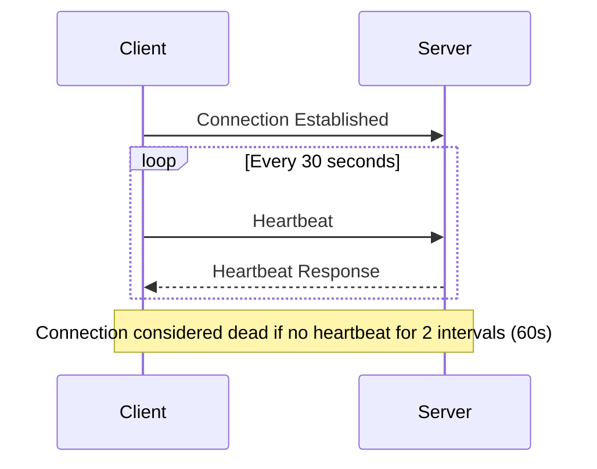
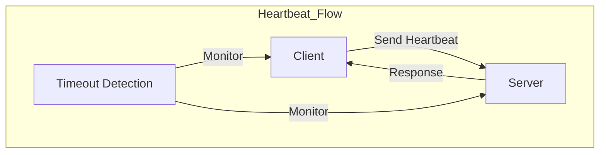
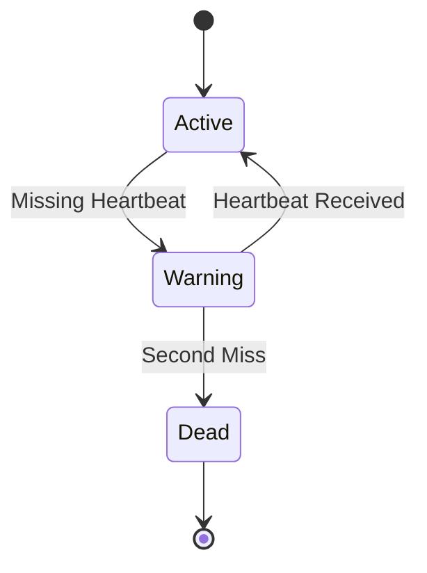
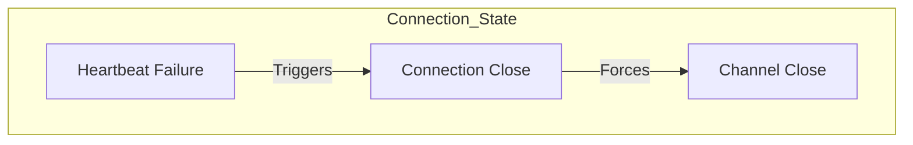
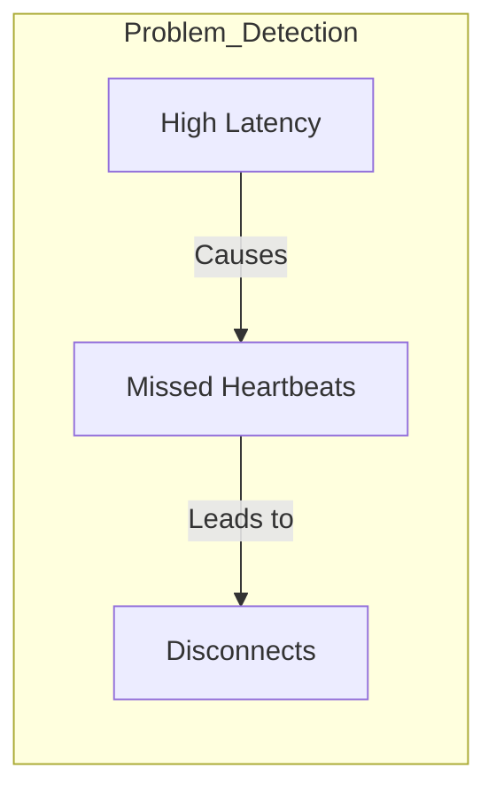

# RabbitMQ Heartbeat Configuration Guide

## Understanding Heartbeat



## Current Configuration
```yaml
internal-consumer:
  connection:
    heartbeat: 30  # seconds
```

## How Heartbeat Works

### 1. Heartbeat Mechanism


1. **Regular Checks**
   - Client sends heartbeat every 30 seconds
   - Server expects heartbeat within timeout window
   - Connection marked as dead after 2 missed heartbeats

2. **Network Impact**
   ```
   Bandwidth per connection = (8 bytes * 2) / 30 seconds
   Daily traffic = ~46KB per connection
   ```

## Heartbeat States



### Connection Lifecycle
1. **Active State**
   - Regular heartbeat exchange
   - Normal operation
   - Low latency

2. **Warning State**
   - One missed heartbeat
   - Connection suspicious
   - Prepare for recovery

3. **Dead State**
   - Two missed heartbeats
   - Connection closed
   - Recovery needed

## Optimal Settings

### 1. Low Latency Network
```yaml
connection:
  heartbeat: 30  # Current setting
```
- Good for stable networks
- Quick failure detection
- Moderate network overhead

### 2. High Latency Network
```yaml
connection:
  heartbeat: 60
```
- Better for unstable networks
- Reduces false positives
- Lower network overhead

### 3. Critical Systems
```yaml
connection:
  heartbeat: 15
```
- Fastest failure detection
- Higher network overhead
- More sensitive to network issues

## Impact on Channel Closure



### Channel Closure Scenarios
1. **Normal Closure**
   - Clean shutdown
   - Graceful disconnect
   - Recoverable state

2. **Heartbeat Timeout**
   - Abrupt closure
   - All channels closed
   - Requires recovery

## Monitoring Heartbeat

### 1. Connection Monitoring
```bash
# Check connection status
rabbitmqctl list_connections name client_properties state

# Monitor heartbeat settings
rabbitmqctl list_connections name heartbeat
```

### 2. Network Statistics
```bash
# Check network health
rabbitmqctl list_connections name peer_host peer_port state

# Monitor connection metrics
rabbitmqctl list_connections name recv_oct send_oct
```

## Troubleshooting Guide

### 1. High Network Latency


Solution:
```yaml
connection:
  heartbeat: 60  # Increase tolerance
  connection_timeout: 15000  # Add connection timeout
```

### 2. Frequent Disconnects
```bash
# Monitor disconnection rate
rabbitmqctl list_connections name connection_details state |
  grep -c "closed"

# Check network stats
rabbitmqctl list_connections name peer_host state
```

## Best Practices

### 1. Setting Selection
- Consider network stability
- Account for application requirements
- Balance detection speed vs overhead

### 2. Implementation
```java
// Spring AMQP configuration
@Bean
public CachingConnectionFactory connectionFactory() {
    CachingConnectionFactory factory = new CachingConnectionFactory();
    factory.setRequestedHeartBeat(30);
    factory.setConnectionTimeout(15000);
    return factory;
}
```

### 3. Monitoring Setup
```yaml
management.metrics.enable.rabbitmq=true
```

## Recovery Strategy

### 1. Automatic Recovery
```java
@Bean
public SimpleRabbitListenerContainerFactory rabbitListenerContainerFactory() {
    SimpleRabbitListenerContainerFactory factory = 
        new SimpleRabbitListenerContainerFactory();
    factory.setRecoveryInterval(5000);
    factory.setMissingQueuesFatal(false);
    return factory;
}
```

### 2. Manual Recovery
```java
connection.addShutdownListener(cause -> {
    if (cause.isHardError()) {
        log.error("Connection lost due to: " + cause.getReason());
        // Implement recovery logic
    }
});
```

## Recommendations

1. **For Your Setup**
   - Current 30s setting is good for stable networks
   - Consider 60s if seeing frequent disconnects
   - Monitor connection metrics

2. **Additional Configuration**
   ```yaml
   connection:
     heartbeat: 30
     connection_timeout: 15000
     recovery_interval: 5000
   ```

3. **Monitoring Setup**
   - Track connection states
   - Monitor heartbeat failures
   - Set up alerts for repeated failures
