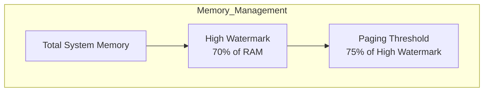
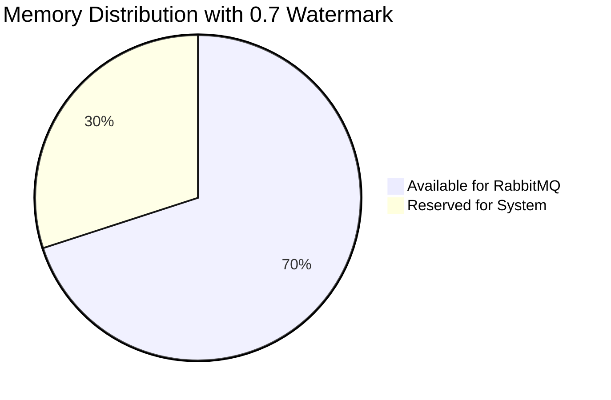
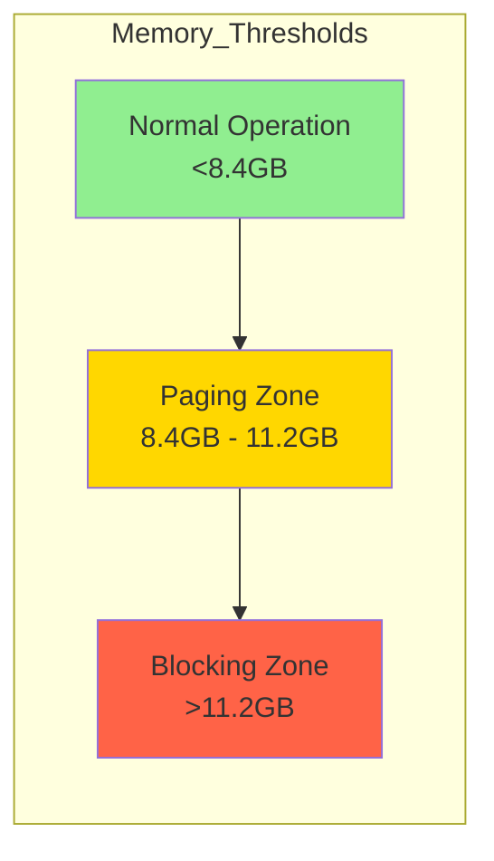
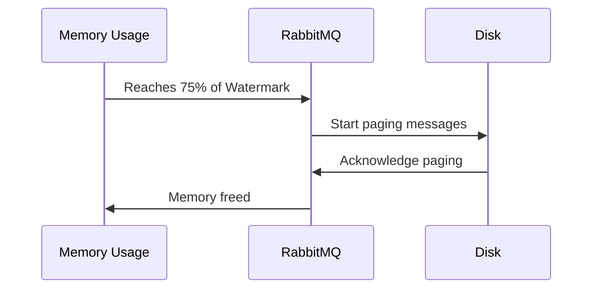
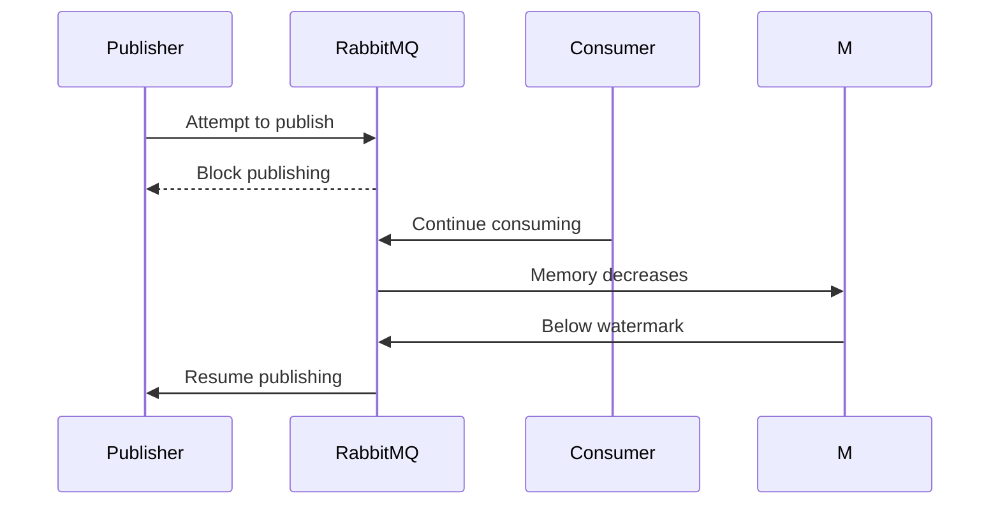
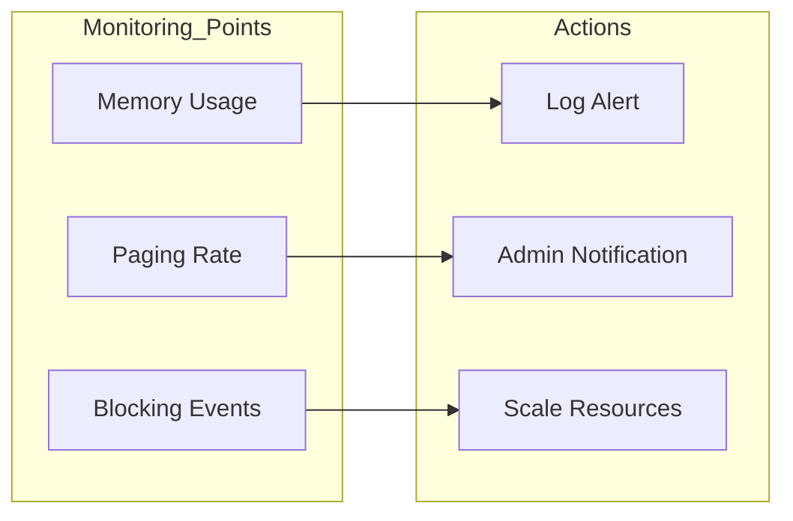
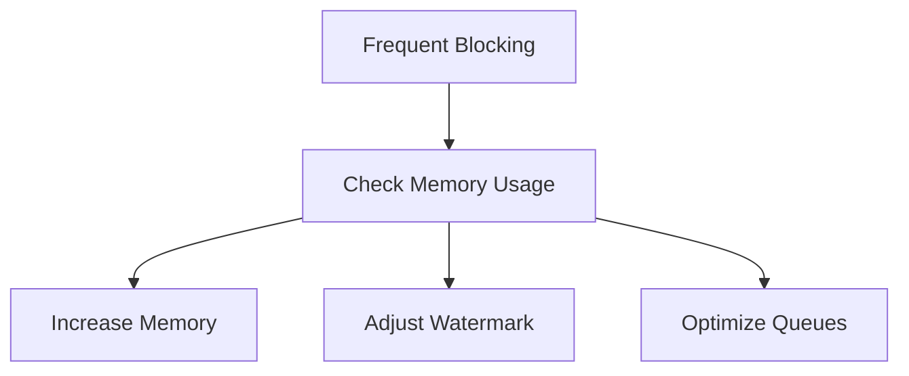
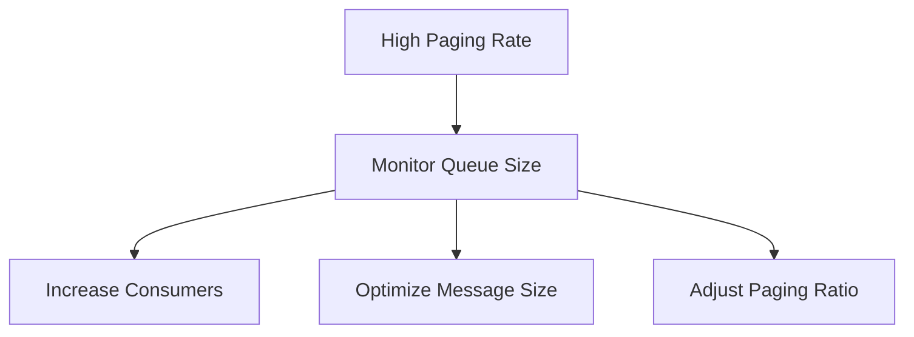
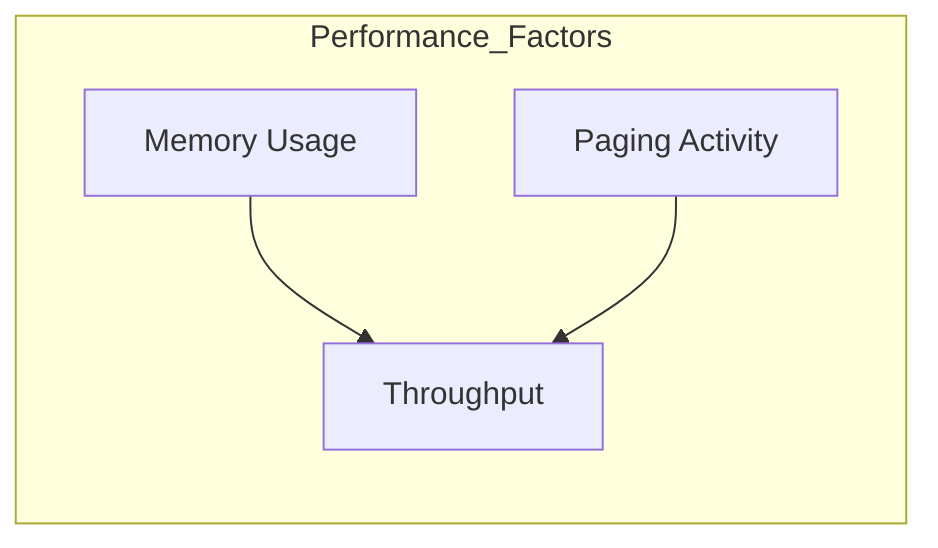

# RabbitMQ Memory Configuration Guide

## Memory Watermark Configuration



### 1. High Watermark Setting
```ini
vm_memory_high_watermark.relative = 0.7
```

This setting means:
- RabbitMQ will use up to 70% of available system memory
- When memory usage reaches 70%, RabbitMQ starts blocking publishers
- Protects the system from running out of memory

#### Example Calculation
```plaintext
System Memory: 16GB
High Watermark: 16GB × 0.7 = 11.2GB
```



### 2. Paging Ratio Setting
```ini
vm_memory_high_watermark_paging_ratio = 0.75
```

This setting means:
- Paging begins at 75% of the high watermark
- Example: If high watermark is 11.2GB, paging starts at 8.4GB
- Messages are moved to disk to free up memory



## Memory States and Actions

### 1. Normal Operation (<75% of Watermark)
- All messages handled in memory
- Optimal performance
- No paging or blocking

### 2. Paging State (75% - 100% of Watermark)


### 3. Blocking State (>100% of Watermark)


## Configuration Examples

### 1. High-Memory System (64GB RAM)
```ini
# For systems with large memory
vm_memory_high_watermark.relative = 0.8
vm_memory_high_watermark_paging_ratio = 0.75
```

### 2. Low-Memory System (4GB RAM)
```ini
# For systems with limited memory
vm_memory_high_watermark.relative = 0.5
vm_memory_high_watermark_paging_ratio = 0.8
```

### 3. Absolute Value Setting
```ini
# Alternative: Set exact memory limit
vm_memory_high_watermark.absolute = 4GB
```

## Monitoring and Alerts



### Memory Usage Commands
```bash
# Check current memory usage
rabbitmqctl status | grep memory

# Monitor memory alarms
rabbitmqctl list_alarm

# Detailed memory breakdown
rabbitmqctl eval 'rabbit_vm:memory().'
```

## Best Practices

1. **Memory Sizing**
   - Monitor actual usage patterns
   - Account for peak loads
   - Leave headroom for system operations

2. **Tuning Guidelines**
   ```ini
   # Production settings
   vm_memory_high_watermark.relative = 0.7    # Standard setting
   vm_memory_high_watermark_paging_ratio = 0.75 # Balance between performance and safety
   ```

3. **Monitoring Setup**
   - Set up alerts before reaching watermark
   - Monitor paging frequency
   - Track blocking events

## Troubleshooting

### Common Issues and Solutions

1. **Frequent Blocking**


2. **High Paging Rate**


### Recovery Steps

1. **Immediate Actions**
```bash
# Clear problematic queues
rabbitmqctl purge_queue queue_name

# Force garbage collection
rabbitmqctl eval 'garbage_collect().'
```

2. **Long-term Solutions**
   - Implement message TTL
   - Use lazy queues for large messages
   - Implement back pressure mechanisms

## Performance Impact



### Impact Levels
1. **Normal Operation** (<75% watermark)
   - Optimal performance
   - No paging overhead
   - Maximum throughput

2. **Paging Zone** (75-100% watermark)
   - Slightly reduced performance
   - Some disk I/O overhead
   - Maintained throughput

3. **Blocking Zone** (>100% watermark)
   - Reduced publisher throughput
   - Increased latency
   - Potential message backlog
