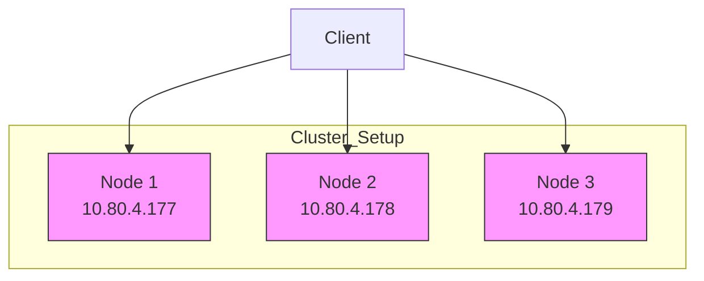
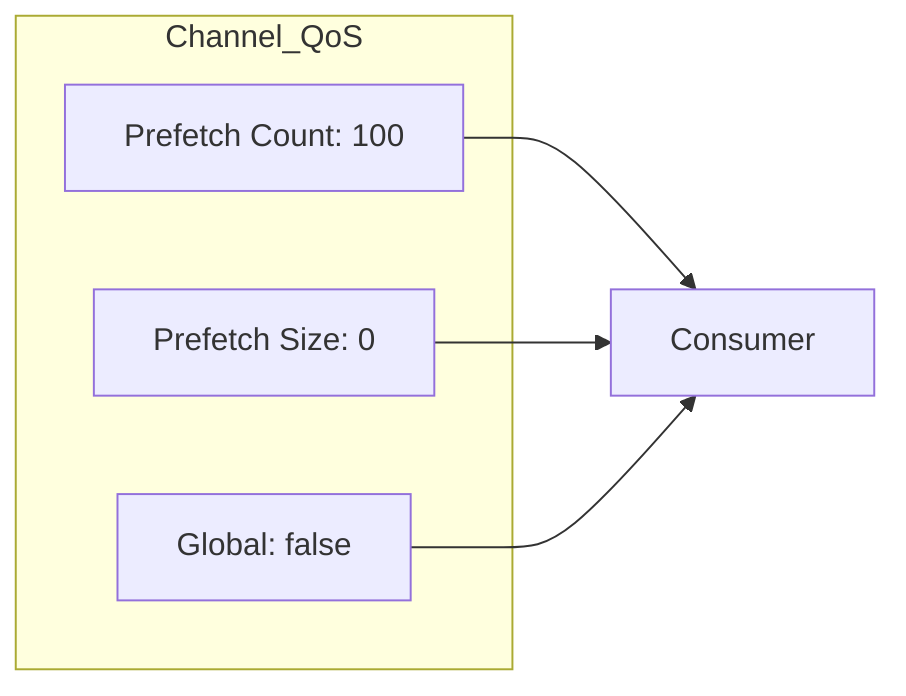
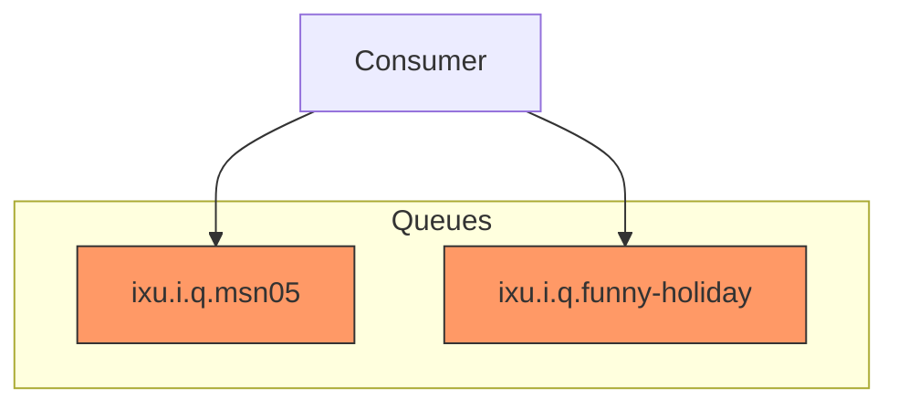
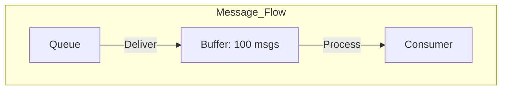

# Spring Boot RabbitMQ Configuration Explained

## Connection Configuration

```yaml
internal-consumer:
  connection:
    url: "10.80.4.177"
    port: "5672"
    user: "odin"
    password: "helloworld"
    vhost: "odin"
    heartbeat: 30
    addresses:
      - "10.80.4.177"
      - "10.80.4.178"
      - "10.80.4.179"
```

### Connection Details Explained



1. **Cluster Configuration**
   - Three RabbitMQ nodes in cluster
   - Client can connect to any node
   - Automatic failover support

2. **Connection Parameters**
   - `url`: Primary node address
   - `port`: AMQP default port (5672)
   - `vhost`: "odin" virtual host for isolation
   - `heartbeat`: 30 seconds keepalive
   - `addresses`: List of all cluster nodes

## Channel Configuration

```yaml
channel:
  prefetch_count: 100
  prefetch_size: 0
  global: false
```

### Channel QoS Settings



1. **Prefetch Settings**
   - `prefetch_count: 100`: Maximum unacknowledged messages
   - `prefetch_size: 0`: No byte limit for messages
   - `global: false`: Settings apply per consumer

2. **Impact**
   ```mermaid
   sequenceDiagram
       participant Q as Queue
       participant C as Consumer
       
       Note over Q,C: Max 100 unacked messages
       Q->>C: Message 1
       Q->>C: Message 2
       Q->>C: ... (up to 100)
       C-->>Q: Ack Message 1
       Q->>C: Message 101
   ```

## Queue Configuration

```yaml
queues:
  msn05:
    name: "ixu.i.q.msn05"
    cluster: 1
  funny-holiday:
    name: "ixu.i.q.funny-holiday"
    cluster: 1
```

### Queue Structure



1. **Queue Naming Convention**
   - Prefix: `ixu.i.q`
   - Names: `msn05` and `funny-holiday`
   - Structured naming for organization

2. **Cluster Setting**
   - `cluster: 1`: Queue replication factor
   - Ensures high availability

## Performance Implications

### 1. Connection Level
- Heartbeat every 30 seconds
- Cluster-aware configuration
- Automatic failover support

### 2. Channel Level


- 100 messages in-flight limit
- Per-consumer throttling
- No size restrictions

### 3. Queue Level
- High availability (cluster: 1)
- Organized naming structure
- Multiple queue support

## Best Practices

1. **Connection Management**
   - Use cluster addresses for failover
   - Maintain reasonable heartbeat
   - Proper virtual host isolation

2. **Channel Optimization**
   ```java
   // Spring AMQP example
   @Bean
   public SimpleRabbitListenerContainerFactory rabbitListenerContainerFactory() {
       SimpleRabbitListenerContainerFactory factory = new SimpleRabbitListenerContainerFactory();
       factory.setPrefetchCount(100);
       factory.setAcknowledgeMode(AcknowledgeMode.MANUAL);
       return factory;
   }
   ```

3. **Queue Handling**
   - Use meaningful queue names
   - Set appropriate HA policies
   - Monitor queue depths

## Monitoring Recommendations

1. **Connection Monitoring**
   ```bash
   # Check cluster status
   rabbitmqctl cluster_status
   
   # Monitor connections
   rabbitmqctl list_connections
   ```

2. **Channel Monitoring**
   ```bash
   # Check consumer counts
   rabbitmqctl list_queues name consumers messages
   
   # Monitor channel status
   rabbitmqctl list_channels
   ```

3. **Queue Monitoring**
   ```bash
   # Check queue status
   rabbitmqctl list_queues name messages_ready messages_unacknowledged
   ```
