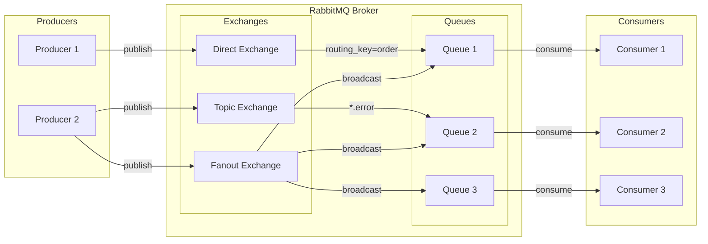
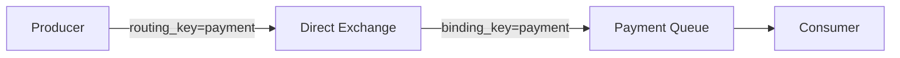
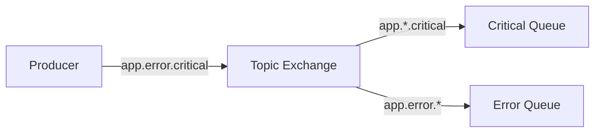
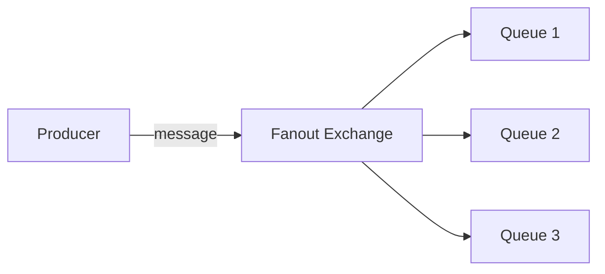
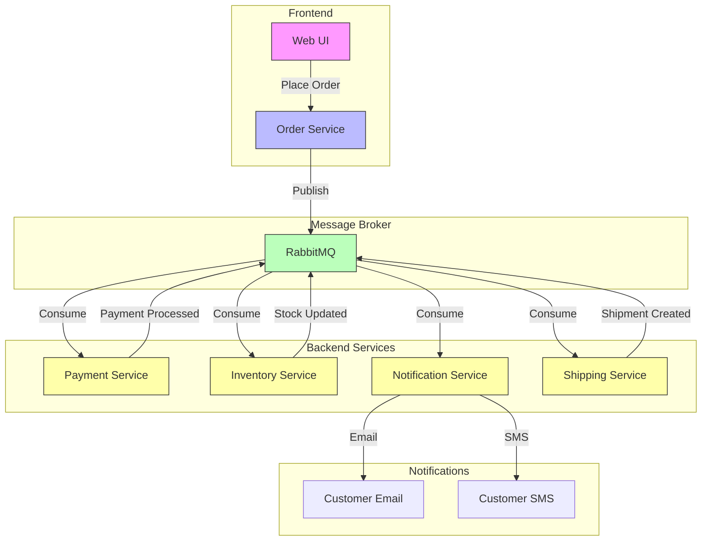
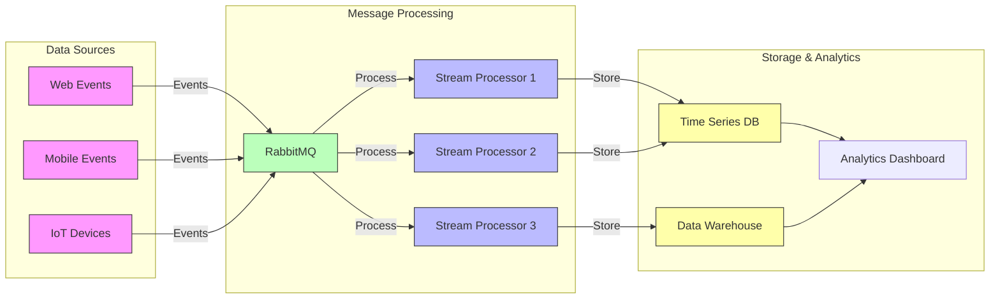
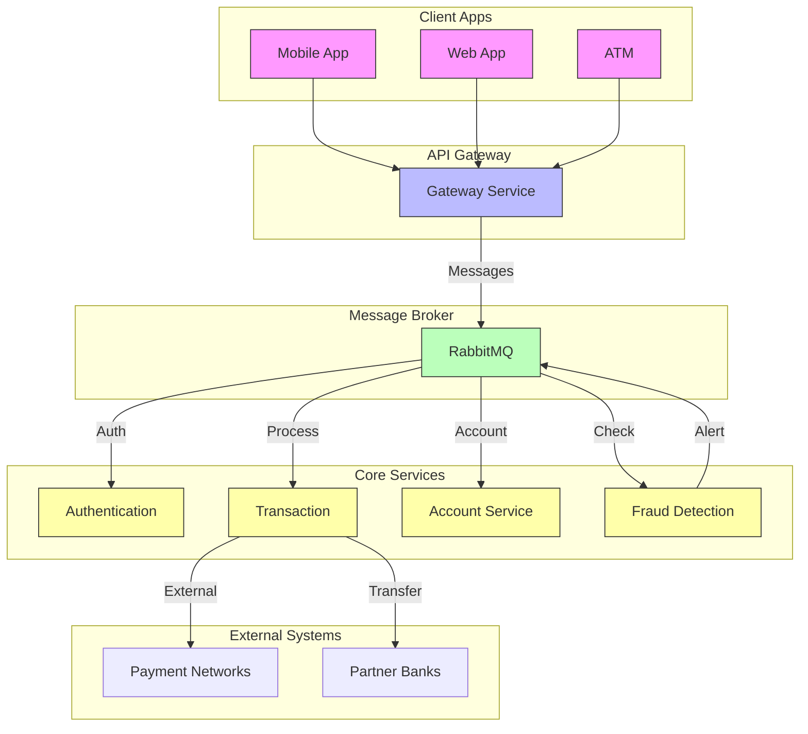

# RabbitMQ Documentation

## Table of Contents
- [Overview](#overview)
- [Core Concepts](#core-concepts)
- [Architecture](#architecture)
- [Message Flow](#message-flow)
- [Exchange Types](#exchange-types)
- [Best Practices](#best-practices)
- [Common Use Cases](#common-use-cases)
- [Implementation Examples](#implementation-examples)
- [Real-World Application Examples](#real-world-application-examples)

## Overview

RabbitMQ is a robust open-source message broker that implements the Advanced Message Queuing Protocol (AMQP). It acts as an intermediary for messaging, enabling applications to communicate and exchange information efficiently.

### Key Features
- Message Persistence
- Reliable Delivery
- Flexible Routing
- High Availability
- Built-in Management UI
- Security & Authentication
- Cross-Platform Support
- Multiple Protocol Support

## Core Concepts

### Producer
- Application that sends messages
- Responsible for publishing messages to exchanges
- Can specify message properties (persistence, priority, TTL)

### Consumer
- Application that receives messages
- Subscribes to queues
- Processes messages and sends acknowledgments

### Queue
- Buffer that stores messages
- FIFO (First In, First Out) by default
- Can be configured for different priorities
- Supports persistence and mirroring

### Exchange
- Receives messages from producers
- Routes messages to queues based on rules
- Different types for different routing patterns

### Binding
- Link between exchange and queue
- Defines routing rules
- Can include routing keys and arguments

## Architecture



## Message Flow

1. **Publishing**
   - Producer creates a message
   - Message is sent to an exchange
   - Message includes routing key and headers

2. **Exchange Routing**
   - Exchange receives the message
   - Applies routing rules based on type
   - Forwards to appropriate queue(s)

3. **Queue Storage**
   - Messages are stored in queues
   - Can be persisted to disk
   - Waits for consumer processing

4. **Consumption**
   - Consumer subscribes to queue
   - Receives messages
   - Processes and acknowledges

## Exchange Types

### Direct Exchange
- Routes based on exact routing key match
- Good for direct point-to-point messaging


### Topic Exchange
- Routes based on routing key patterns
- Supports wildcards (* and #)


### Fanout Exchange
- Broadcasts to all bound queues
- Ignores routing keys


### Headers Exchange
- Routes based on message headers
- Ignores routing key
- Matches on header attributes

## Best Practices

### Message Handling
- Always use acknowledgments
- Implement retry mechanisms
- Set appropriate TTL
- Monitor queue lengths

### Security
- Enable SSL/TLS
- Use VHOST isolation
- Implement authentication
- Set up authorization

### Performance
- Monitor memory usage
- Configure appropriate prefetch
- Use lazy queues for large messages
- Implement back pressure

### High Availability
- Set up clustering
- Configure queue mirroring
- Use federation for WAN
- Implement disaster recovery

## Common Use Cases

1. **Microservices Communication**
   - Asynchronous messaging
   - Service decoupling
   - Event-driven architecture

2. **Task Distribution**
   - Work queues
   - Load balancing
   - Background processing

3. **Event Broadcasting**
   - Notifications
   - Real-time updates
   - System monitoring

4. **Request-Reply Pattern**
   - RPC implementation
   - Distributed systems
   - Service integration

## Implementation Examples

### Python Example (using pika)
```python
import pika

# Connection
connection = pika.BlockingConnection(
    pika.ConnectionParameters('localhost'))
channel = connection.channel()

# Declare queue
channel.queue_declare(queue='hello')

# Publish message
channel.basic_publish(exchange='',
                     routing_key='hello',
                     body='Hello World!')

# Close connection
connection.close()
```

### Consumer Example
```python
import pika

def callback(ch, method, properties, body):
    print(f" [x] Received {body}")

connection = pika.BlockingConnection(
    pika.ConnectionParameters('localhost'))
channel = connection.channel()

channel.queue_declare(queue='hello')

channel.basic_consume(queue='hello',
                     auto_ack=True,
                     on_message_callback=callback)

print(' [*] Waiting for messages...')
channel.start_consuming()
```

## Real-World Application Examples

### 1. E-Commerce Order Processing System


### 2. Real-time Analytics Pipeline


### 3. Microservices Communication in Banking


### Benefits Demonstrated in These Flows:

1. **Decoupling**
   - Services can operate independently
   - Failures in one service don't cascade to others
   - Easy to add/remove services

2. **Scalability**
   - Services can scale independently
   - Multiple consumers can process messages in parallel
   - Load balancing happens automatically

3. **Reliability**
   - Messages are persisted until processed
   - Failed operations can be retried
   - No data loss during service outages

4. **Flexibility**
   - Easy to add new consumers
   - Support for different message patterns
   - Multiple communication protocols

5. **Monitoring & Control**
   - Centralized message tracking
   - Flow control and rate limiting
   - Error handling and dead letter queues

---
For more information, visit the [official RabbitMQ documentation](https://www.rabbitmq.com/documentation.html).
